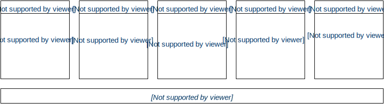

# Architectural Overview

***In this article we take a quick tour of the complete framework, its classes and features. We will visit the most important topics and requirements for developing Mono applications.***

#### Who should read this?

If you wish to understand the concepts and thoughts behind the frameworks structure, this article is for you. Or if you should choose to read only one in-depth article, it should definitely be this one!

## Overview

*Mono Framework* is a collection of C++ classes, all build on top of the [mbed library](http://developer.mbed.org) created by ARM. The complete Mono software stack consists of 3 levels of abstractions, which are separate libraries:

1. **Mono layer** (C++): All high-level classes
2. **mbed layer** (C++/C): Hardware level I/O and functions (including most of stdlib)
3. **Cypress layer** (C): Hardware dependent code, generated by PSoC Creator

In this article we focus mainly on the *Mono layer*. Mono is an open system, so you have access to the underlying layers from your application. However, you should use only layer 3 (and some of mbed), if you really can not avoid it. Using these layers might break compatibility with future hardware releases and the *to-be-released* simulator.

## API Overview

Below is a diagram of the features provided by *Mono Framework*. These are the high-level interfaces that makes it fast and easy, for you to take advantage of all Mono's features.



As you can see in the diagram, the features can be grouped by their function. Some framework classes are generic, like the [String](../reference/mono_String.md) class. Other serves a specific purpose, like providing the accelerometer interface ([IAccelerometer](../reference/mono_sensor_IAccelerometer.md)).

## Core Concepts

Since there is no operating system, your application will run on *bare metal*, meaning it interfaces the hardware directly. On a versatile platform, such as Mono, it means that your application must deal with some critical events and concepts. In the next sections we shall take a look at the key functions and requirements of all applications targeting the OpenMono platform.

### Application lifecycle

The application lifecycle is the time from execution of the first instruction to the last. In conventional environments this is from `main()` gets called, until it returns:

```cpp

	// This is a normal familiar C++ application main function:
	int main(char *argv[], int argc)
	{
		// Application lifecycle begins
		
		// do stuff
		
		// Application lifecycle ends
		return 0;
	}
```

This is the case when you are inside an operating system. Mono is an embedded platform, so here the lifecycle is quite different and determined by the power *on* and power *off* events.

When the CPU powers up, it will immediately start executing your application. And it will not stop before you cut the CPU's power source - literally! There is no `return 0` that stops your application.

#### Mono is Always on

Mono's hardware is always powered, because there is just no power switch! You can not simply cut the power to the CPU, when you what to turn off Mono. The "*turn off*" feature needs to be the software that throttles down the CPU and puts all peripherals into a low power state. We call this state: ***sleep mode***.

Mono Framework helps you with handling *sleep mode*. By default Mono's side-button will toggle sleep mode. It will put Mono to sleep, and wake Mono up again if pressed during sleep. You do not need to do anything to support sleep mode, it is provided to you by the framework. Only if you need to make use of the side-button for you own purpose, you must provide a way of going to sleep. This is done by calling the `IApplicationContext::EnterSleepMode` method:

```cpp
// put mono into sleep mode:
mono::IApplicationContext::EnterSleepMode(); // execution halts here until wake-up

// only after wake-up will EnterSleepMode return
printf("Mono has awaken!");
```

Because power is never cut from the CPU, it rarely resets. The application state is preserved across sleep cycles, meaning that your application lifespan will be long. Even significantly longer when compared to desktop applications. The long lifespan makes the application more vulnerable to errors, such as memory leaks, corrupting memory or stack overflows. The point is: it is a tough job to be an embedded developer <i class="fa fa-smile-o"></i>.

#### Power On Reset

The term *Power On Reset* or *POR* means the initial reset that occurs when the CPU powers on. This is when the power supply is first asserted or the physical H/W reset line is de-asserted. On Mono a POR is the same as a hardware reset.

A POR can be triggered in a number of different ways:

 * Pressing mono reset button
 * If Mono's battery is completely drained, the power control subsystem will cut the CPU's supply. When Mono is charged, the power to the CPU will be restored and a POR happens.
 * Uploading a new application to Mono, using `monoprog`.
 * Your application can trigger a *SoftwareReset*, that results in a POR.

Every Mono application is required to handle the POR event. It is here your application must setup all needed peripherals, such as temperature sensor or SD Card file I/O. If you use any [UI Widgets](../reference/reference.md), you need to initialize them on POR as well.

Later in the [Required virtual methods](#required-virtual-methods) section, we shall see how you handle the POR event.

#### Sleep and Wake-up

We expect the POR events to be relatively rare, compared the number of sleep and wake up events. When Mono goes to sleep it turns off all peripherals to minimize power consumption.

You have the option to handle the *go to sleep* and *wake from sleep* events, as we shall see in the section about the [The AppController](#the-appcontroller). We imagine you might need to do some book-keeping or clean-ups before entering sleep. Likewise, you may need some setup after waking from sleep. If you use the display, you *will* need to take repaint actions when waking from sleep.

However, it you are lazy could could just trigger a *SoftwareReset* upon *wake from sleep*, but you would loose any state that is not serialized.

```eval_rst
.. The procedure of going to sleep is:
   1. Call your applications default `monoWillGotoSleep()` handler.
   1. Run through all objects that registered themselves as [`IPowerAware`](../references/mono_power_IPowerAware.md), and call their `monoWillGotoSleep()` method.
   1. Tell the Power System IC to turn off peripheral power, which powers off:
 	 * Wireless module
 	 * SD card
 	 * Display
 	 * Accelerometer
 	 * Temperature sensor
   1. Turn off all on-chip communication interfaces: SPI, I2C, USB etc.
   1. Set all I/O pins to high-impedent inputs, to preserve power
   1. Halt the CPU's instruction fetch (sleep)

   * handle when mono goes to sleep
   * handle when mono wakes from sleep
   * for the lazy: you may just software reset on "wake from sleep"
   * as default the user button will sleep/wake mono -->
```

### The run loop

Like most modern application runtimes, Mono has an internal run loop. The loop handles periodic tasks, like sampling the touch system, updating the display, processing Timers and handling any other asynchronous task. You can inject your own tasks into the run loop, and there by achieve the Arduino-like `loop()` functionality.

The run loop is started right after your POR handler returns, and runs for the entire length of the application lifecycle.

```eval_rst
..	Before we look at the different classes that utilize the run loop, let us reflect a little over application types.
	
	##### Event based Applications

	We can call most modern GUI applications *event based*. By this term we mean applications that change their state based on events. Events are mostly user input such as mouse clicks on computers, or touch input on Mono. They might also change state based on other sources, such as remote server push messages. Examples for event based applications are mails clients, ToDo-list apps, text editors etc.

	If you are developing an events based application, you will not need an Arduino-like `loop()` function, because your application does do anything before receiving some kind of input. Mono Framework makes it easy to develop event based applications by providing events that you can respond to. Your application is only called then an event arrives. At all other times, the framework handles the execution. In this aspect Mono Framework acts just like .NET, Qt and Cocoa.

	##### Real-Time Applications

	The opposite of event based applications are what we call Real-Time applications. Real-Time apps typically a datasource that is ever changing. Like a graphing app that displays a realtime signal, like an audio or accelerometer signal. The inherent nature of these signal are that they always changes. In these cases events would be extranous, because it is implicit that the signal always changes.

	Real-Time applications tend to refresh themselves at a constant rate, like displaying a movie with a framerate of 60 Hz. In such applications you would need a `loop()` function, to handle the constant flow of data. Luckily you can still do that by injecting tasks into the run loop.-->
```

#### Callback functions

Because we have a run loop we can make tasks asynchronous. This does not mean your code will run concurrently, it means that you can put tasks in the background. You do not need to think about race-conditions and other rough topics related to parallelism.

You use callback functions to handle events that arrive, and require your action. For example you can schedule a function call in the future. The [Timer](../reference/mono_Timer.md) class can schedule a function getting called 5 secs from now:

```cpp

	mono::Timer::callOnce<MyClass>(5000, this, &MyClass::futureFunction);
```

Notice the syntax here. We use C++ templates and function pointers. Reason is the complexity of context and function pointers in C++. In C you create function pointers with ease:

```c

	void MyFunction() {}

	setCallback(&MyFunction);
```


* we have callback functions for C++
* beside C function pointers, you can use C++ member pointers (type info is preserved!)


##### Events

* most apps a events based, they change state on events
* events are touch input, power/sleep triggers or button interrupts
* events are handled in callback functions and member method overrides
* a todo list app changes state on touch events, between events it does nothing

##### Timers

* Timers trigger a periodic event handler callback
* Real-Time apps might update its state/content on a regular interval
* Timers can also be used to call a function at some point in the future (as soon as possible).

##### Queued interrupts

* in embedded environment interrupts are hardware triggers, that call a C function (the ISR)
* the ISR should be fast and return very quickly - a lot of concurrency issues arise when using ISR.
* mono uses Queued interrupt, where the ISR is handled in the run loop.
* no concurrency issues
* you can longer lived ISR's
* they can debounce your hardware input signals, to create more robust handling of button or switches

### The AppController

All application must have a app controller - this is there entry point

#### Required virtual methods


#### Application Entry Point & Startup

1. static inits
2. main func
3. app ctrl POR method
4. run loop

## The Bootloader

## Crashes and Exceptions

## Best Pratice

some do and dont's

## Further reading

in depth articles:

* Boot and Startup procedures
* Queued callbacks and interrupts
* [[Display System Architecture|display_system_architecture]]
* Touch System Architecture
* Wifi & networking
* Power Management Overview
* Memory Management: Stack vs heap objects?
* Coding C++ for bare metal
* The Build System

