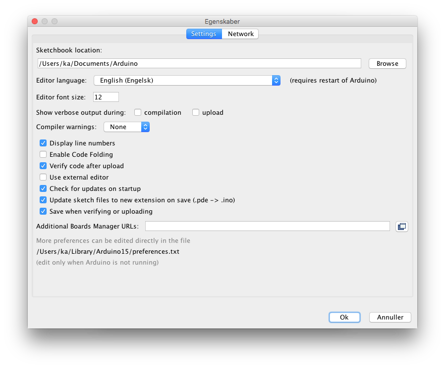
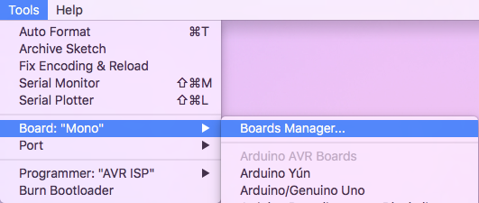
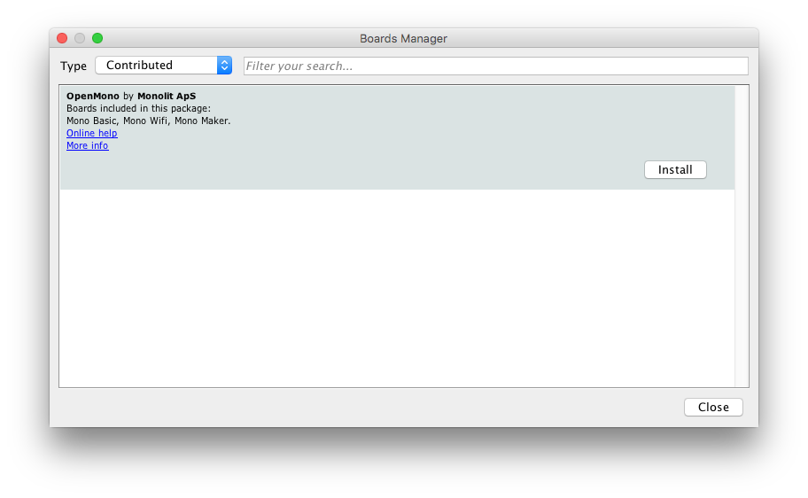
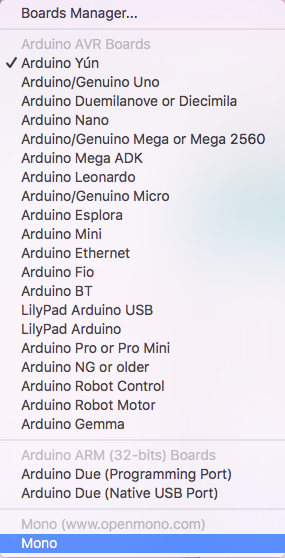

# Mono for Arduino Hackers

***You can use the familiar Arduino IDE to build Mono applications. This guide will take you through the steps.***

```eval_rst
	.. caution:: **Our Arduino Board package extension is a pre-release. There are still issue with the Serial port and uploading sketches. Some API still needs implementation. If you have issues, please post on** `community.openmono.com <https://community.openmono.com>`_.
```

## Prerequisites

First I expect you are familiar with Arduino, its coding IDE and the API's like `pinMode()` etc. I also assume that you have the IDE installed, and it is version 1.6.7 or above. You do not have to follow any other of the getting started guides. Arduino IDE development for Mono is completely independed. If this is the first Mono guide you read, it is all good.

## Overview

You can code Mono using 2 approaches: Native Mono or the Arduino IDE. The difference is the tools you use, and the way you structure your code. In the Arduino approach you get the familiar `setup()` and `loop()` functions, and you use the Arduino IDE editor to code, compile and upload applications to Mono.

Under the hood we still use the native Mono API's and build system, we just encapsulate it in the Arduino IDE.

## Installation

The Arduino IDE has a plugin system, where you can add support for third-party boards. We use such a plugin, that adds Mono as a target board. To install the plugin we use the *Board Manager*, that can install new target boards.

```eval_rst
.. note:: You need Arduino IDE version 1.6 or above to utilize the Board Manager feature. You can download Arduino IDE here: `arduino.cc <https://www.arduino.cc/en/Main/Software>`_
```

#### Add Mono as a board source

To make the Board Manager aware of Mono's existence, you must add a source URL to the manager. You do this by opening the preferences window in Ardiono IDE. Below is a screenshot of the window:



In the text field called *Additional Boards Manager URLs* type in the URL for Mono board package:

```
https://github.com/getopenmono/arduino_comp/releases/download/0.8/package_openmono_index.json
```

And press *OK*. 

##### Install the board package

Now, open the *Board Manager* by selecting the menu: *Tools -> Boards -> Board Manager*:



The *Board Manager* appears, and query the source URLs for new board types. It will discover a new board type OpenMono. Select the type *Contributed*, in top left corner:



Now click on the *Install* button to download and install all the needed tools to build mono applications. This might take a few minutes.

When the installation is done, you can close the *Board Manager* and return the main window. Now select Mono from the list of available target boards: 



##### Install the USB Serial Port Driver

If you run Windows, there is an additional step. (Mac users, you can skip this section.) Windows need to detect the Mono hardware as an USB CDC device and create an ol' fashion COM port. So download the USB device definition driver by right clicking the link and choosing *Save file as*:

*[raw.githubusercontent.com/getopenmono/mono_psoc5_library/master/Generated_Source/PSoC5/USBUART_cdc.inf](https://raw.githubusercontent.com/getopenmono/mono_psoc5_library/master/Generated_Source/PSoC5/USBUART_cdc.inf)*

When you connect Mono the *New hardware found...* wizard should appear, and you must direct this wiazrd to search for a driver in the directory where you downloaded the `.inf` file.

```eval_rst
.. note:: Windows will yell at you because the driver is not signed. Just hold your breath and choose *continue anyway*, to install the driver. We promise it is legit :)
```

## Limitations

The standard Arduino boards are much simpler than Mono. For example: They can be turned off and they have bare pin headers. Arduino API are made to make digital and analog communication simple. You have functions like `digitalWrite` and `analogRead`. While you have these function available, you do not have any pin headers sticking out of Mono chassis! You need the *Arduino Shield Adaptor* or to build your own hardware to really take advantage of the Arduino API.

Mono's API is much more high-level, meaning that you have functions like *Render text on the screen*, and the software library (Mono Framework) will handle all the communication for you. Luckily you can still do this from inside the Arduino IDE.

## Hello World

Let us build a Hello World application, similar to the one in the [The obligatory Hello World project](hello_world.md) guide. We start out with the default Arduino project template:

```cpp

	void setup() {
		// put your setup code here, to run once:
		
	}
	
	void loop() {
		// put your main code here, to run repeatedly:
		
	}
```

We will use the class [TextLabelView](../reference/mono_ui_TextLabelView.md) to displat text on the screen. A *TextLabel* has a size and a position on the screen, which is defined by the class [Rect](../reference/mono_geo_Rect.md) that represents a rectangle.

### Context issue

You might think we just create the TextLabel in the `setup()` function like this:

```cpp

	void setup() {
		// put your setup code here, to run once:
		
		mono::ui::TextLabelView helloLbl;
	
	}
```

But this approach will deallocate the textlabel as soon as the setup() function returns. This means it cannot  be rendered to the screen, because it have to be present in memory when screen repaints occur.

The correct approach here is to create a class (say *MyClass*), and let the *TextLabel* be a member of that class. We than create an object of the class in te global context. (Outside the `setup()` and `loop()` functions.) But all this will be out of scope with this tutorial, so we will do it the ugly way <i class="fa fa-smile-o"></i>. Just know that having many global context objects, is a bad thing programmatically.

### Adding the TextLabel

The complete code added to the project global context and in the `setup()` function:

```cpp

	#include <mono.h>     // 1
    
	mono::ui::TextLabelView textLbl(mono::geo::Rect(0,20,176,20),"Hi, I'm Mono"); // 2
    
	void setup() {
		// put your setup code here, to run once:
		textLbl.setTextColor(mono::display::WhiteColor);   // 3
		textLbl.show();   // 4
	}

```

I have numbered the interesting source code lines, let go through them one by one:

1. We include the Mono Framework, to have access to Mono's API.
2. Here we define the global *TextLabel* object called `textLbl`. Because it is global it will stick around and not be deallocated.
   * In *TextLabelView*'s contructor we create a rectangle object ([Rect](../reference/mono_geo_Rect.md)), and give the position ``$(0,50)$`` and dimension ``$(176,20)$``.
   * In the constructors second parameters we set the text content on the *TextLabel*. This is the text that will be displayed on the screen.
3. Because the screen on the Arduino template app is black, we need to tell the label to use a *White* text color.
4. We tell the *TextLabel* to render itself on the screen. All UI widgets are hidden by default. You must call `show()` to render them.

Now you can press the compile button (<i class="fa fa-check"></i>) and see the code compiles. If you have Mono connected you can upload the application by pressing the <i class="fa fa-arrow-circle-right"></i> button.

Notice that we did not need to put any code inside the `loop()` function.

### Enhancing the look and feel

To make our Hello World exactly like the [The obligatory Hello World project](hello_world.md) guide, we need to add some refinements to it. We need to center the text on the screen and to color it a fancy red color. But that easy, just two calls added to the `setup()` function:

```cpp

	textLbl.setAlignment(mono::ui::TextLabelView::ALIGN_CENTER);
	
	textLbl.setTextColor(mono::display::AlizarinColor);
```

Now, if you build and run the application the text will be a fancy color and centered on the screen:


## A quick note on namespaces

If find yourself wondering about what this is: `mono::ui::`, then read on. Everybody else - you can skip this section.

C++ uses namespaces to encapsulate class names, minimizing the risk of conflicting names. If you for example define a class called `Stream`, you like likely get a compiler error. This is because Arduino already have a class called `Stream` - the name is already taken.

To avoid this situation we defined all Mono classes inside a *namespace*, meaning that we exists inside a enclosed context:

```cpp

	namespace mono {
		class String;
		class Stream;
		class WhatEver;
	}
```

You access classes inside a namespace by prepending the namespace to the class name like this: `mono::String`. Namespaces can be nested like this:

```cpp

	namespace mono {
		namespace display {
			class Color;
		}
		
		namespace ui {
			class TextLabelView;
		}
	}
```

### Importing into global context

You can import a namespace into the global context, to avoid prepending all mono classes with `mono::`, by the `using` keyword:

```cpp

	using namespace mono;
```

Now, instead of accessing classe by `mono::String`, you just write `String`, the `mono::` has become implcit. You can import multiple namespaces into the global context by:

```cpp
	
	using namespace mono;
	using namespace mono::ui;
	using namespace mono::display;
```

Now you can implicit access classes from 3 different namespaces!

*Note*: The classes are not imported or loaded into the global context (like in Python), C++ does not work that way. It is just a short hand convenience feature, to make the code less verbose.

## Further reading

Now you know how to build mono applications from the Arduino IDE. You might what dive into the native API and build system, or reading one of the in-depth articles:

* [Install the native framework](install.md) : Install the native mono build system
* [Architectural Overview](../articles/architectural-overview.md) : About application lifecycles and structure.

Happy hacking.