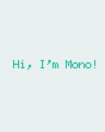

# The *Hello World* project

**Now, let us create the obligatory *Hello World* project, that does not do anything else than verify your installation works.**

### Prerequisites

By now I expexct you have installed the Mono tool chain, as decribed in the previous tutorial. Also, it is best if you are familiar with object oriented programming. If you are not, then you might find yourself thinking "what the heck is a class and inheritance!" But read on anyways, but I will recommend to read our Object oriented guide to C++.

## Create a new project

Mono comes with a tool called `monomake`, that does one thing - and one thing only: creating new mono projects. Let's try it!

#### Open a terminal

* Mac/Linux: Open the Terminal application
* Window: Press Windows-key + R, and type `cmd` then hit Enter

#### Create project

In the terminal, navigate to the directory where you would like to create the project. Then:

```
$ monomake project hello_world
```

Hit Enter and `monomake` will create a new folder called `hello_world` with 3 files inside:

* `app_controller.h`
* `app_controller.cpp`
* `Makefile`

These 3 files are required for all mono applications. I will not go into too many details here, but just tell you that `app_controller.h` defines the class `AppController`, that is the application entry point. It replaces the `main()` function.

Now, `cd` into the project folder `hello_world`:

```
	$ cd hello_world
```

#### Compile

The project already contains code that compiles, so the only thing you need to do is:

```
	$ make
```

Now the tool chain compiles the application:

```
	Compiling C++: app_controller.cpp
	Compiling C++: System default mono_default_main
	Linking hello_world.elf
```

Voila, your mono application compiled and the executable is `hello_world.elf`. This is the file that can be uploaded to Mono.

If you already have mono connected via USB, you can upload your new application to it by:

```
	$ sudo make install
```

The `install` command will search to any connected Mono's, reboot it and upload the application. If everything went smoothly you should see the text *Hi, I'm Mono* on the display.

## The code

Okay, we got the code running on Mono - but what really happens in the code? In this section we sill look at the template code in `AppController`.

First, let just describe what the application does. It creates a text on the screen that says: "*Hi, I'm Mono*". That's it. More specific, it creates a *TextLabel* that gets the text content, and renders on the screen. I have includes at picture of the application below:



#### Header file

As said, all Mono applications needs an [AppController](../reference/mono_IApplication.md), because it is the entry point for all mono applications. Let's take a look at the code in `app_controller.h`:

```cpp

	#include <mono.h>			// 1

	using namespace mono;		// 2
	using namespace mono::ui;

	class AppController : public mono::IApplication {   // 3
    

    	TextLabelView helloLabel;    	// 4
    
	public:
    
    	AppController();				// 5
    
    	void monoWakeFromReset();		// 6

    	void monoWillGotoSleep();		// 7

    	void monoWakeFromSleep();		// 8
    
	};

```

I have added numbers to the interresting code lines in comments. Let's go through each of the lines, and see what it does:

1. We include the framework. This header file, is an umbrella that include all the classes in Mono framework. Every mono application need this include.
2. All mono framework classes exists inside a namespace called `mono`. We include namespace in the context, to make the code less verbose. This allows us to write `String()`, instead of `mono::String()`. (And yes, mono has its own string class!)
3. Here we define the `AppController` class itself. It inherits from the abstract interface called `IApplication`. This interface defines the 3 methods the `AppController` must have. We shall examine them shortly.
4. Here we define the *TextLabel* object that will display our text on the screen. It is defined as a member of the `AppController` class.
5. We overwrite the [default contructor](https://en.wikipedia.org/wiki/Default_constructor) for our `AppController` class, to allow us to do custom initialization. You will see later why.
6. This is a required overwrite from the `IApplication`interface. It is a method that is called when mono is reset.
7. Also a requirement from `IApplication`. It defines a method that is called just before mono is put into sleep mode.
8. As required by `IApplication`, this method is called when mono wake up from sleep mode.

All [`AppController`](../reference/mono_IApplication.md)'s are required to implement 6,7 and 8, but you may just leave them blank.

#### Implementation

Now, the contents of: `app_controller.cpp` file:

```cpp

	#include "app_controller.h"

    using namespace mono::geo;

    AppController::AppController() :
        helloLabel(Rect(0,100,176,20), "Hi, I'm Mono!")       // 1
    {
        
        helloLabel.setAlignment(TextLabelView::ALIGN_CENTER); // 2
    
        helloLabel.setTextColor(display::TurquoiseColor);     // 3
    }

    void AppController::monoWakeFromReset()
    {
        helloLabel.show();             		                // 4
    }

    void AppController::monoWillGotoSleep()
    {
    
    }

    void AppController::monoWakeFromSleep()
    {
        helloLabel.scheduleRepaint();			                // 5
    }

```

Again, I have numbered the most interesting code lines:

1. This the default constructor overwrite. We overwrite the contructor to construct the *TextLabel* object with specific parameters. (See [TextLabelView reference](../../reference/mono_ui_TextLabelView.html#_CPPv2N13TextLabelView13TextLabelViewEN3geo4RectE6String)) We set the labels position and size on the screen (using the [Rect class](../reference/mono_geo_Rect.md)), and its text content.
2. In (1) we defined the text labels width to be the entire screen (176 pixels). We want to center the text on the screen, therefore we tell the label to center align its text content.
3. To make application look fancy, we set the text color to be an artzy turquoise color.
4. The method `monoWakeFromReset` is automatically called upon reset. Inside here we tell the text label to be visible. All UI widgets are hidden by default. You must call `show()` to render them.
5. `monoWakeFromSleep` is called when Mono wakes from sleep mode. Here we tell the label to repaint (render) itself on the screen. Sleep mode might have cleared the display memory, so we need to render the label again. `scheduleRepaint` will render the text, when the display signals its time to update.

That is all the code you need to draw on the screen. Notice that we left the method `monoWillGotoSleep` empty. We do not need any clean up code, before mono goes to sleep.

#### Sleep mode

But how and when will Mono go into sleep mode? Easy: By default the side-button on Mono will trigger sleep and wake. You do not have do anything! Sleep mode will turn off all peripherals and halt the CPU execution. Only a button press will wake it. Sleep mode is only way you can turn off Mono!

## Further reading

* [Your first App](tic-tac-toe-part-1.md) : Build a Tic Tac Toe game (Part 1)
* [Archectural Overview](../articles/architectural-overview.md) : Learn more about sleep/wake and `IApplication`
* [Display System Architecture](../articles/display_system_architecture.md) : An in-depth look on details of the display system.
