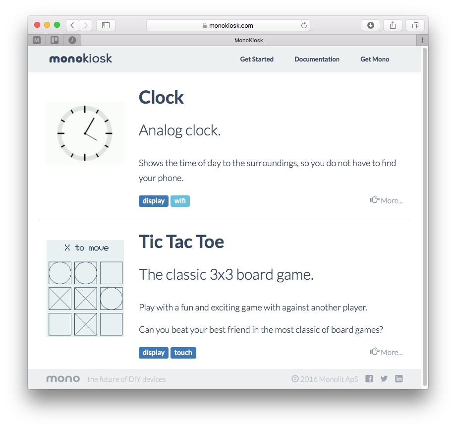
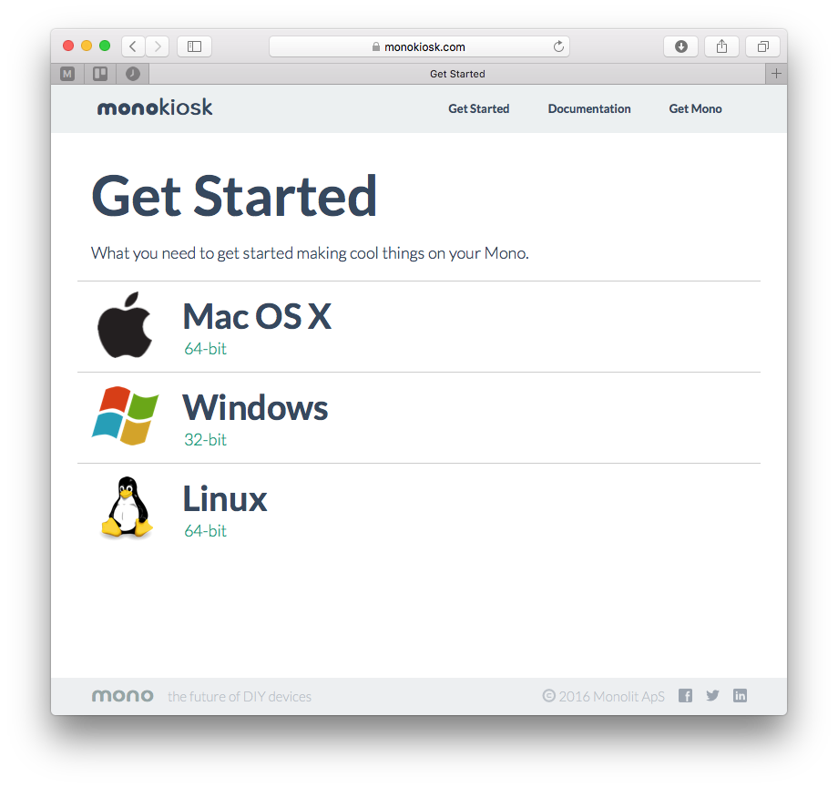
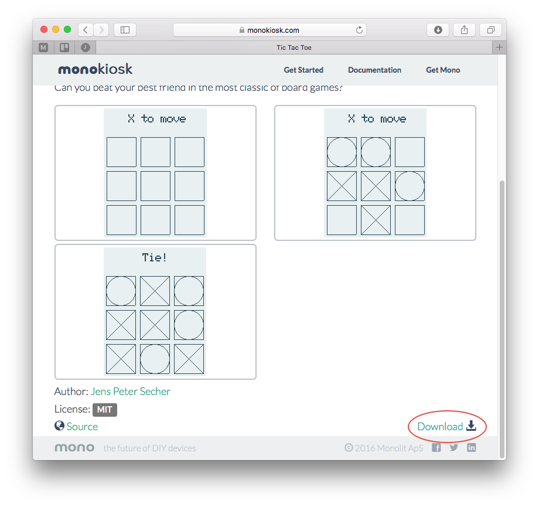
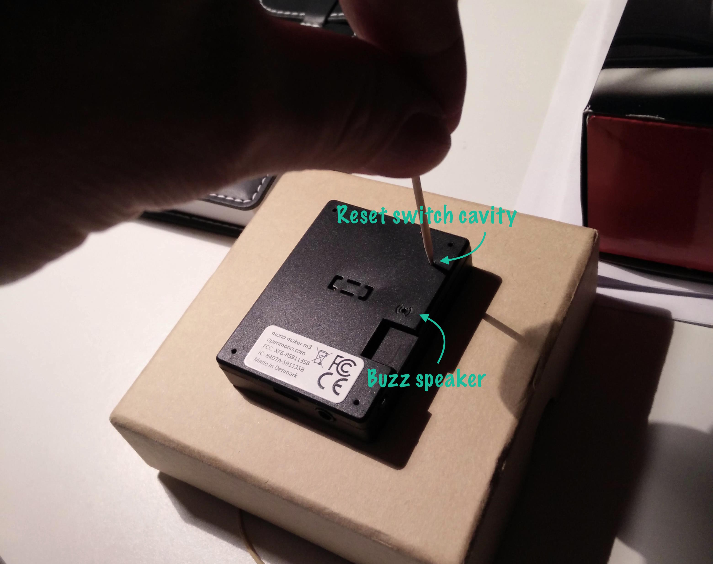

# Using Monokiosk

***If you want to install an existing app from Monokiosk, on to your Mono device - this guide is for you!***

In this guide we will show you how to download and install a pre-built application on Mono. Monokiosk is the *app store* where you can browse and download mono applications, built by makers from around the world.

```eval_rst
.. note:: In this early phase the number of applications on monokiosk is quite limited. We plan to add more applications to the kiosk ourselves, and hope that our community will submit their own creations to the site.
```

But until then, let us focus on the few apps we have in the kiosk right now. In this guide we shall install the *Tic Tac Toe* sample app.

## Visit monokiosk.com

First order of business, direct your favorite browser to **[monokiosk.com](https://monokiosk.com)**, and you will see this page like this:



Currently there are a simple *Clock* app and and a *Tic Tac Toe* app. But before you franticly click on one of these crazy mind blowing apps, you first need to install a tool called **monoprog**.

*Monoprog* is a programmer. A programmer is an application that transfers application files to mono, using the USB port. You need this tool to get the application from the computer to your Mono device. When you install applications from Monokiosk, the overall procedure is:

1. Download the application from monokiosk. (An application is a file with the extension: *.elf*)
1. Use *monoprog* to transfer the downloaded *.elf* file to Mono.
1. There is no step 3!

First you must download monoprog itself, so click on *Get Started* in the menu bar. Nowyou will see this page:



Choose the option that fits you or your OS. The downloads are installers that will install *monoprog* on your system.

```eval_rst
.. admonition:: Linux Users:

	We have compiled a debian package for you. You need to use the `dpkg` tool to install the package, and then run `apt-get install` to install any dependencies. Non-debian users: You are skilled enough to compile monoprog from `source <https://github.com/getopenmono/monoprog>`_.

```

## Download Tic Tac Toe

Now, go back to the frontpage and click on the *Tic Tac Toe* app. You will now see this page, where you need to scroll down to the download link at the bottom right:



When you click the link, the file `ttt.elf` will be downloaded to your computer. This file is the application binary file and it is compatible with all present Mono models. Save the file in a folder, that you can easily reach from a terminal. Yes, now we must use terminal or command prompt.

## Transfer the app to Mono

```eval_rst
.. attention:: Since this is the first version of *monoprog*, it is a command line application. We have plan to wrap it inside a nice GUI - but for now bear with us.
```

Open a terminal window:

* On Mac / Ubuntu: Open the Terminal application.
* On Windows: Press `Window-key + R`, type `cmd` and hit Enter.

Type type this in the console, to verify monoprog is installed:

```
$ monoprog
Usage: monoprog [options]
Bootloadable Programmer for Mono board.

Options:
  -h, --help             Displays this help.
  -V, --version          Displays version information.
  --license              Displays licenses of software components.
  -d, --detect           Detects whether a Mono is connected via USB.
  --mock <type>          Simulates device to be in <type>.
  -p, --program <app>    Transfers <app> to Mono.
  -v, --verbose <level>  Set output verbosity level (default is 1).
  -q, --quiet, --silent  Set output verbosity level to 0.
```

If you see a message similar to this one, then everything is awesome! If your console brags about unknown command or application, then please run the installer again.

Connect Mono to your computer using a standard microUSB cable.

Before monoprog can transfer the application, your Mono must be in bootloader mode. Mono is in bootloader to 1 sec after reset, but you can force it to stay in bootloader:



1. Find a small piece of metal wire to insert into the reset switch hole, on Mono's back. (You can also use a paper clip.)
2. Then push the wire into the reset switch cavity, and hold down the user button on Mono's side. (***Note**: Do not push the wire into the buzzer opening.*)
3. Release the reset switch first, then release the user button.

Mono is now in bootloader and will stay in bootloader. Do a standard reset to bring Mono out of bootloader.

```eval_rst
.. danger:: Do *not* leaves Mono in bootloader! This will drain the battery until power is cut by the under voltage protection circuit. Even with such a circuit, the battery will still suffer from the discharging.
```

Next, navigate to the directory where you placed the file `ttt.elf`. Then write this *monoprog* command:

```
$ monoprog -d
```

*Monoprog* will now try to find any connected Mono devices. If your device is found it returns: *Mono device detected*. To transfer (program) the app to Mono write:

```
$ monoprog -p ttt.elf
```

Now, *monoprog* programs the application binary code to Mono's internal flash memory. If everything goes well Mono will wake up and display the *Tic Tac Toe* app. Next, you can find a friend to play Tic Tac Toe with, you can download the other app or you could consider creating your own!

 


