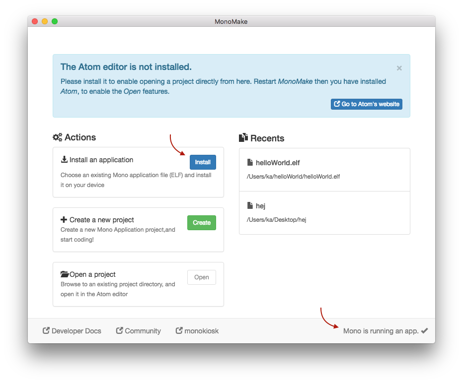

# Using Monokiosk

***If you want to install an existing app from Monokiosk, on to your Mono device - this guide is for you!***

In this guide we will show you how to download and install a pre-built application on Mono. Monokiosk is the *app store* where you can browse and download mono applications, built by makers from around the world.

```eval_rst
.. note:: We plan to add more applications to the kiosk ourselves, and hope that our community will submit their own creations to the site.
```

## Visit monokiosk.com

First order of business, direct your favorite browser to **[monokiosk.com](https://kiosk.openmono.com)**, and you will see this page like this:


Currently there are a simple *Clock* app and and a *Tic Tac Toe* app. But before you franticly click on one of these crazy mind blowing apps, you first need to install our *MonoMake* tool to install the application onto Mono.

*MonoMake* is an application that _programs_ the application on Mono. Such a _programmer_ transfers application files to mono, using the USB port. You need this tool to get the application from your computer to your Mono device. When you install applications from Monokiosk, the overall procedure is:

1. Connect Mono to your computer using an USB cable
1. Make sure Mono is *on*
1. Click the *Install* button in MonoKiosk, for the app you wish to install.

However, **first** you must download *MonoMake* itself, so click on the button that suits your system:

<table class="table wy-text-center" style="width: 100%;">
<tr><th>Windows</th><th>macOS</th><th>Debian/Ubuntu</th></tr>
<tr>
<td><a href="../downloads/windows.html" class="btn btn-neutral"><span class="fa fa-download"></span> Download </a></td>
<td><a href="../downloads/macos.html" class="btn btn-neutral"><span class="fa fa-download"></span> Download</a></td>
<td><a href="../downloads/linux.html" class="btn btn-neutral" target="_blank"><span class="fa fa-download"></span> Download</a></td>
</tr>
</table>
<br />

Choose the option that fits you or your OS. The downloads are installers that will install *monoprog* on your system.

```eval_rst
.. note:: This software you have installed is the complete toolset for developing OpenMono applications. However, you dont need to use that. Here, we are just using the tool *MonoMake*.
```

## Install Tic Tac Toe

After you have download and installed the OpenMono SDK on your system, let's continue.

Go to the frontpage and click on the *Tic Tac Toe* app. You will now see this page, where you will see the *install button* at the bottom right:


When you click the link, the *install* button, the *MonoMake* application will launch. *MonoMake* will automatically download the chosen application binary and install it on to Mono.

Now the application's binary code is loaded to Mono's internal flash memory. If everything goes well Mono will wake up and display the *Tic Tac Toe* app. Next, you can find a friend to play Tic Tac Toe with, you can install the other app or you could consider creating your own!

## Manual installs

If, for some reason *MonoMake* does not launch when you click the *install* button - there are other options. Scroll down and click the *Download* button instead. This downloads the application binary file (*.elf*) to your computer. When the file is downloaded, launch *MonoMake* yourself.



Make sure that *Monomake* can see your connected (and *running*) Mono device. This is indicated at the lower right corner. Now, click the blue *Install* button left of the center. A standard *Open file* dialog box will open. Navigate to the just downloaded application *.elf* file, and open it.

*MonoMake* installs the application onto Mono.


