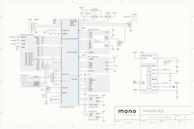
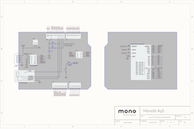

# Schematics

***This is the schematics for our hardware. These are meant to help you develop our own extensions to Mono, go create!***

If you need more specific schematics than what is shown here, please consider posting a request on our [community](https://community.openmono.com).

## Mono (Maker + Basic)

<table class="table wy-text-center">
	<tr>
		<td><a href="https://github.com/getopenmono/monodocs/raw/master/schematics/mono_v3_functional_schematic.pdf" class="btn btn-neutral"> PDF</a></td>
		<td><a href="https://github.com/getopenmono/monodocs/raw/master/schematics/mono_v3_functional_schematic.png" class="btn btn-neutral"> PNG</a></td>
	</tr>
</table>
 

If you have a Mono Basic, it is the same as Maker, just without the Wifi / Bluetooth component mounted.

## Mono Shield Adapter

<table class="table wy-text-center">
	<tr>
		<td><a href="https://github.com/getopenmono/monodocs/raw/master/schematics/msa_v1_functional_schematic.pdf" class="btn btn-neutral"> PDF</a></td>
		<td><a href="https://github.com/getopenmono/monodocs/raw/master/schematics/msa_v1_functional_schematic.png" class="btn btn-neutral"> PNG</a></td>
	</tr>
</table>
 