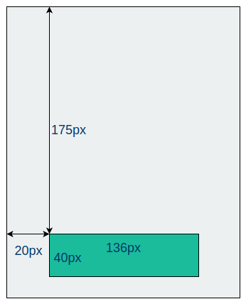
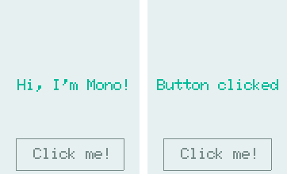
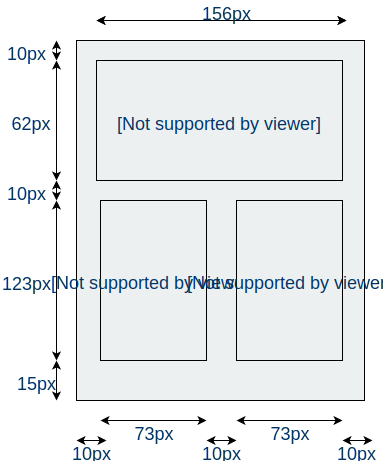

# Adding a Button to the sceen

***In this quick tutorial we shall see how to add a set of push buttons to the screen.***

The SDK comes this standard classes for screen drawing and listening for touch input. One of these classes are [`ButtonView`](/en/latest/reference/mono_ui_ButtonView.html). *ButtonView* display a simple push button and accepts touch input.

## Reacting to clicks

Let us go create a new Mono project, fire up your terminal and:

```
$ monomake project buttonExample
```

To create a button on the screen we first add a `ButtonView` object to `AppController`. Insert this into *app_controller.h*:

```
class AppController : public mono::IApplication {
    
    // This is the text label object that will displayed
    TextLabelView helloLabel;

    // We add this: our button object
    ButtonView btn;
    
public:

    // The default constructor
    AppController();

    // We also add this callback function for button clicks
    void buttonClick();
```


We added a member object for the button itself and a member method for its callback. This callback is a function that is called, then the button is clicked.

Now, in the implementation file (app_controller.cpp), we add the button the contructor initializer list:

```
AppController::AppController() :

    // Call the TextLabel's constructor, with a Rect and a static text
    helloLabel(Rect(0,100,176,20), "Hi, I'm Mono!"),

    // Here we initialize the button
    btn(Rect(20, 175, 136, 40), "Click me!")
{
```

The button's constructor takes 2 arguments: *position and dimension* rectangle and its *text label*. The first argument is a [`Rect`](/en/latest/reference/mono_geo_Rect.html) object, it defines the rectangle where the Button lives. This means it will draw itself in the rectangle and listen for touch input in this rectangle:



The second argument is the text label that is displayed inside the button. In this example it is just the text *Click me!*

To trigger a response when we click the button, we need to implement the function body for the `buttonClick` method. In *app_controller.cpp* add this method:

```
void AppController::buttonClick()
{
    helloLabel.setText("Button clicked!");
}
```

This method changes the content of the project templates existing `helloLabel` to a new text. Lastly, we connect the button click handler to call our function. From inside the `monoWakeFromReset` method, we append:

```
// tell the label to show itself on the screen
helloLabel.show();

// set the callback for the button click handler
btn.setClickCallback<AppController>(this, &AppController::buttonClick);
// set the button to be shown
btn.show();
```

That's it! Run `make install` and see the example run on Mono:



## Multiple buttons

Now let us change the scenario a little. We want to create a *clicker* app, to count how many people enter and leave a stadium. We wanna end up with an app that looks like this blueprint:



THere should be two button, one couting up and one counting down. At the top we have a `TextLabelView` that displays the current count. From the pixel measurements on the drawing we can create the objects in code.

Let us create a new project:

```
$ monomake project clickerApp
```

In the header file (*app_controller.h*), we add add two buttons and change the name of the existing `TextLabelView` called *helloLabel*. Also, we add a counter variable and 2 callback methods, oe counting up and one counting down.

```
class AppController : public mono::IApplication {
    
    // This is the counter text label object that will displayed
    TextLabelView counterLbl;

    // This is our button objects
    ButtonView upBtn, downBtn;
    
    // this is the count value
    int counter;
    
public:

    // The default constructor
    AppController();

    // callabck function for button clicks
    void upBtnClick();
    void downBtnClick();
    
    // ... rest of app_controller.h ...
```

Next, goto the implementation file (app_controller.cpp) and add the two buttons and the `counter` variable to constructor's initializer list:

```
AppController::AppController() :

    // Call the TextLabel's constructor, with a Rect and a static text
    counterLbl(Rect(10,10,156,62), "ClickerApp"),

    // initialize the buttons and counter variable
    upBtn(Rect(10, 10+62+10, 73, 123), "Up"),
    downBtn(Rect(10+73+10, 10+62+10, 73, 123), "Dwn"),
    counter(0)
{
    // the label is the full width of screen, set it to be center aligned
    counterLbl.setAlignment(TextLabelView::ALIGN_CENTER);
    
    // set another text color
    counterLbl.setTextColor(display::TurquoiseColor);
}
```

Because we changed the name of the `TextLabelView` object, we have to remember to change the reference from inside the `monoWakeFromSleep` method, to:

```
// (Normally) after sleep, the screen memory has been cleared - tell the label to
// draw itself again
counterLbl.scheduleRepaint();
```


We also need to add the function bodies for the two callback methods:

```
void AppController::upBtnClick()
{
    counter++;

    String cntText = String::Format("%i",counter);
    counterLbl.setText(cntText);
}
void AppController::downBtnClick()
{
    counter--;

    String cntText = String::Format("%i",counter);
    counterLbl.setText(cntText);
}
```

The two method are almost identical, expect they either incrment or decrement the `counter` variable. The other 2 lines are to convert the integer into a [`String`](/en/latest/reference/mono_String.html) object. And lastly, we set the new text content on the label.

Now, the last step is to connect the two callback methods with the click handlers on the button objects. We do that from inside the `monoWakeFromReset`:

```
void AppController::monoWakeFromReset()
{
    // At this point after reset we can safely expect all peripherals and
    // I/O to be setup & ready.

    // tell the label to show itself on the screen
    counterLbl.show();

    // set the callback for the button click handler
    upBtn.setClickCallback<AppController>(this, &AppController::upBtnClick);
    downBtn.setClickCallback<AppController>(this, &AppController::downBtnClick);

    // set the button to be shown
    upBtn.show();
    downBtn.show();
}
```

That is it. Now we are ready to fire up the app with `make install`.