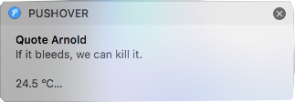
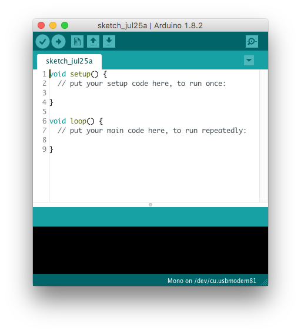
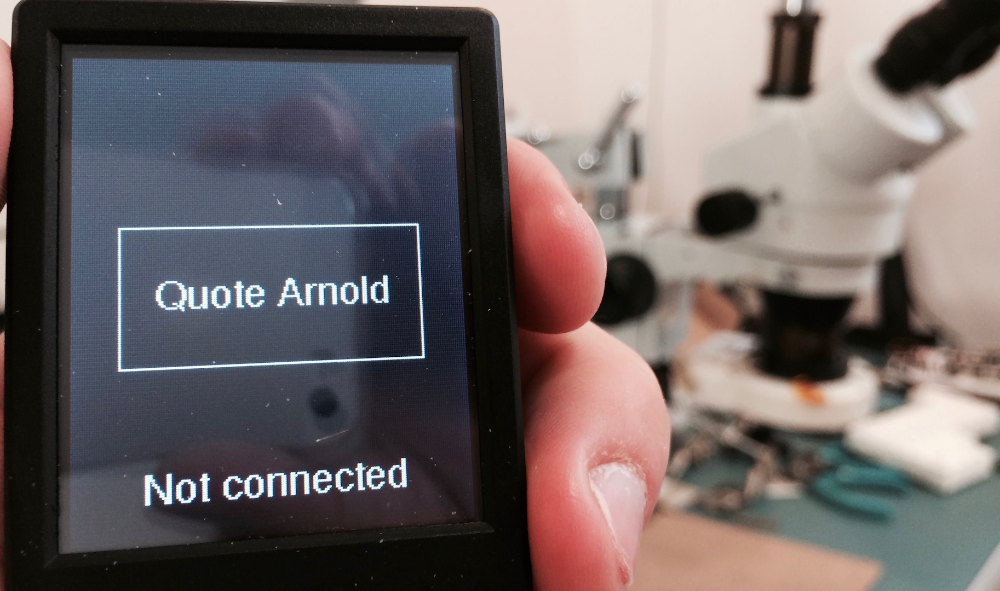

# Triggering IFTTT Webhooks

**In this example we shall see how to use Mono to trigger a webhook on _IFTTT_. To demonstrate this, we create an application _Quote Arnold_ using Arduino SDK. This app will send random Schwarzenegger movie quotes to IFTTT.**

### Who should read this?

First I assume you are aware of [IFTTT](https://ifttt.com)  (If This Then That), and know how to setup *Applets* on their platform. You should also be familiar with Arduino IDE, and have installed the *[OpenMono board package](../getting-started/arduino-hackers.md)* using the *Board Manager*. It is (though not required), preferred if you know a good share of classic Arnold Schwarzenegger movies.

## Quote Arnold

Our goal is to create a Mono application that sends randomized Arnold Schwarzenegger movie quotes to IFTTT. On IFTTT we can forward them to the IFTTT app using push notification. Or you can choose to do something else with them. In my IFTTT applet I have chosen to forward the message to *[Pushover](https://pushover.net)*, so I can receive desktop push notifications:



Oh - and by the way, just because we can, we will also send the current temperature and battery level, along with the quote.

## Setup

We will use Arduino IDE to implement our application. Of course we could also use a standard OpenMono SDK project, but I have choosen to demonstrate the use of Arduino IDE with OpenMono here.

To begin with, go ahead and open up Arduino IDE and create a new sketch.



Because Arduino only defines two C functions (`setup` & `loop`), all our resources must be declared in the global context. This means to must declare all *ButtonViews*, *HttpClients* and alike in the global context - that is outside the functions.

Also, because our application is driven by user input (UI button pushes), we will not use the `loop` function at all!

## Adding the push button

For starters we need to add the button that will trigger a quote being sent via a *Http request* to IFTTT.

First, we include *OpenMono* classes and declare two pointers to *[ButtonView](../reference/mono_ui_ButtonView.md)* and *[TextLabelView](../reference/mono_ui_TextLabelView.md)* instances:

```cpp
#include <mono.h>           // include mono library

using namespace mono::ui;   // Add mono namespace
using namespace mono::geo;

ButtonView *button;         // create a ButtonView pointer
TextLabelView *statusLbl;   // a textlabel pointer
```

Inside the `setup` function will create (*construct*) the `ButtonView` and `TextLabelView` objects and position them on the screen:

```cpp
void setup() {
    // Button
    button = new ButtonView(Rect(20, 80, 176 - 40, 65), "Quote Arnold");
    button->setClickCallback(&handleButton);
    button->show();

    // Text status label
    statusLbl = new TextLabelView(Rect(10,180,156,35), "Not connected");
    statusLbl->setAlignment(TextLabelView::ALIGN_CENTER);
    statusLbl->show();
}
```

We use the `new` syntax since we allocate the objects on the *stack*. This was why we created `button` and `statusLbl` as a pointer types.

```eval_rst
.. note:: The C++ ``new`` operator uses *standard lib*'s ``malloc`` function. This means the actual objects are first created inside the ``setup()`` function. This is needed, because we need to the system to be ready when the object are constructed. We cannot create them in global space.
```

We set the button click handler to a function called `handleButton`, which we will define in a moment. Lastly we tell the button to `show()` itself.

We also set the text alignment and content of the *TextLabelView*, before showing it.

Let's add a function for `handleButton` and then try out our code:

```cpp
void handleButton()
{
    // we will add content later
}
```

Go ahead and compile and *upload* the code, and you should see a button and a text label on Mono's display. On my Mono it looks like this:



## Starting Wifi

Before we can send any data to IFTTT, we need to connect to Wifi. Luckily since *SDK 1.7.3* we have a *Wifi* class, that handles wifi setup and initialization. Let's add that to our sketch, also as a pointer that we initialize in `setup()`:

```cpp
// button and text is declared here also
mono::io::Wifi *wifi;

void setup() {
    // Initialization of button and text left out here

    wifi = new mono::io::Wifi(YOUR_SSID, YOUR_PASSPHRASE);
    wifi->setConnectedCallback(&networkReady);
    wifi->setConnectErrorCallback(&networkError);
}
```

Notice that our Wifi object takes two callback functions, for handling the *wifi connected* and *connect error* events. Let's declare these two functions and let them change the `statusLbl` to reflect the new state:

```cpp
void networkReady()
{
  printf("network ready!\r\n");
  statusLbl->setText("Connected");
}

void networkError()
{
  statusLbl->setText("Connect Error");
}
```

Now, we need to call `connect` on *Wifi* when the button is pushed, therefore we add this line inside the `handleButton` function:

```cpp
void handleButton()
{
    wifi->connect();
    statusLbl->setText("Connecting...");
}
```

Now, compile and upload the app. Push the button and if everything is good, you should see "*Connected*" appear. If you encounter errors, a good help is to open Arduino's *Serial Monitor*. The Wifi system is quite verbose on the serial port.

## Pushing to IFTTT

When we have network access, we are ready to do a *HTTP Post* call to IFTTT. On IFTTT you need to setup a custom *Applet* using their [*new applet*](https://ifttt.com/create) site.

The applet's *if this* part must be a *Webhook*. This is the component that receives the data from Mono. You can use whatever service you like as the *then that* part. I used the *Pushover* service, to forward the quote as a *Push Notification*. This means I will get a push notification whenever the Webhook is called.

To get the URL of the webhook, is tricky. Open [this page](https://ifttt.com/maker_webhooks) and click on *Documentation*. The URL should be on the form:

```
https://maker.ifttt.com/trigger/{YOUR_EVENT_NAME}/with/key/{YOUR_API_KEY}
```

When we insert this URL into our mono app, we must remove the **_s_** in *https*. Mono does not yet support HTTPS out-of-the-box.

```eval_rst
.. note:: Lucky for us IFTTT exposes their API on plain old *http* . This means our service is unsecure, however it serves our example. Mono's Wifi hardware supports using *https*, however you need to use the low level Redpine API to access this feature in SDK 1.7.3.
```

### The Http Post client class

Now, let us add a global *[HttpPostClient](../reference/mono_network_HttpPostClient.md)* object next to our existing global pointers. This time though, we will not be using a pointer - but a real object:

```cpp
// previous declarations left out
mono::io::Wifi *wifi;
mono::network::HttpPostClient client;
float temp = 0.0;
int lastBatteryLevel = 100;
```

I have also added global variables for caching the current temperature and battery level. Their usage will become clear in a moment.

We can begin to use the object as soon as the network is ready. That means we must use it only after the `networkReady()` function has fired. Therefore we create a new function called `beginPostRequest()`:

```cpp
void beginPostRequest()
{
  if (!wifi->isConnected()) // bail if network not ready
  {
    statusLbl->setText("not yet ready!");
    return;
  }

  client = mono::network::HttpPostClient(
    "http://maker.ifttt.com/trigger/YOUR_EVENT_NAME/with/key/YOUR_API_KEY",
    "Content-Type: application/json\r\n");
  client.setBodyDataCallback(&httpData);
  client.setBodyLengthCallback(&httpLength);

  temp = mono::IApplicationContext::Instance->Temperature->ReadMilliCelcius() / 1000.0;
  lastBatteryLevel = mono::power::MonoBattery::ReadPercentage();

  client.post();
}
```

This function checks if the network is ready and bails if it is not. Then we create a new *[HttpPostClient](../reference/mono_network_HttpPostClient.md)* object and provide the URL it should call. Notice that we also provide an optional second argument, that is an extra *Http header*. This header defines the *content type* of the *POST* body data.

For the actual body data and the *Content-Length* header we provide 2 callback functions: `httpLength()` and `httpBody()`. The first will return the actual byte length of the body payload data. The second will write the data into a buffer, provided by the system.

Before we send off the request ( `post()` ) we cache the current temperature and battery level. We want the temperature as a floating point so we can extract its decimal values later.

 Now, let's implement the callback functions:

```cpp
uint16_t httpLength()
{
  // get the fraction part of floating point
  int fracPart = 10*(temp - (int)temp);
  return snprintf(0,0, "{ \"value1\": \"%s\", \"value2\": %i.%i, \"value3\": %i}", "Arnold quote here", (int)temp, fracPart, lastBatteryLevel);
}

void httpData(char *data)
{
  // get the fraction part of floating point
  int fracPart = 10*(temp - (int)temp);
  snprintf(data,httpLength()+1, "{ \"value1\": \"%s\", \"value2\": %i.%i, \"value3\": %i}", "Arnold quote here", (int)temp, fracPart, lastBatteryLevel);
}
```

```eval_rst
.. caution:: In Mono's embedded environment we do not have access to ``printf``'s floating point conversion. This conversion takes up so much memory, that it is left out by default. This means the format specifier ``%f`` does not work. Therefore, we must extract the floating point decimals manually.
```

These two functions do basically the same thing. However, the first ( `httpLength()` ) returns the payload data length. We use *stdio*'s `snprintf` to calculate the byte-length of the concatenated formatted string.

The system allocates the buffer needed to hold the payload data, and appends room for a string terminator character. This means `httpData()` can write directly into this buffer.

```eval_rst
.. caution:: Please be aware that ``snprintf`` arguments are a bit quirky. The *max length* argument, that specifies the total size of the data buffer, must include the string terminator. However the returned length of the total string, behaves like ``strlen`` - not including the terminator.
```

Let us not forget to call `beginPostRequest()`. There are two scenarios where we can trigger the call: when the network is *not ready* or when *it is ready*.

If the network is not ready, we should just call the HTTP call from inside the `networkReady()` function:

```cpp
void networkReady()
{
  printf("network ready!\r\n");
  statusLbl->setText("Connected");

  beginPostRequest();
}
```

The other scenario happens if we press the button multiple times. If network is already available, then we should just call `beginPostRequest()` right away, directly from the button handler function:

```cpp
void handleButton()
{
  if (wifi->isConnected())
  {
    beginPostRequest();
    return;
  }
  
  wifi->connect();
  statusLbl->setText("Connecting...");
}
```

That's it! Try it out. Remember to observe the *Serial Monitor* to see if there are any error messages.

```eval_rst
.. tip:: We have not created a callback function that handles the HTTP response from IFTTT. Therefore you will not see any error messages. If you wish to print the HTTP response, then you should setup the `dataReady` callback. (See the tutorial :doc:`./using_the_network`.)
```

## Random quotes from Arnold

Our basic functionality is done, however we don't quote Arnold just yet. Let us now implement a list of great movie quotes and select between them randomly. We must also seed our random generator, such that we don't end up with a determenistic quote sequence.

First we declare a global array of strings, this is our list of quotes:

```cpp
const char *quotes[] = {
  "I'll be back.",
  "You are one ugly motherfucker.",
  "Hasta la vista, baby.",
  "Remember, Sully, when I promised to kill you last?",
  
  "Fuck you, asshole.",
  "Consider this a divorce!",
  "Get to the chopper!!",
  "Honey, you shouldn't drink and bake.",
  
  "Come with me if you want to live.",
  "If it bleeds, we can kill it."
};
int curQuote = 0;
```

Here are 10 quotes. These are some of my favorites. Add or replace them with your favorites, maybe you find those from Arnold's Conan area better? (BTW, [this is a great source](http://arnold-quotes-api.herokuapp.com) of Arnold quotes.)

We also declare an `int` that defines the currently selected quote. When the button is clicked we must select a random value for `curQuote`, between 0 and 9. Therefore add this to the begining of `handleButton()`:

```cpp
void handleButton()
{
  curQuote = rand() % 10;

  if (wifi->isConnected())
  // rest of function is left out
}
```

Now we must replace the static string in the two HTTP body data callbacks: `httpLength()` and `httpData()`. Therefore replace `"Arnold quote here"` with `quotes[curQuote]` in both functions. For `httpData()` the *snprintf*-line should look like this:

```cpp
snprintf(data,httpLength()+1, "{ \"value1\": \"%s\", \"value2\": %i.%i, \"value3\": %i}", quotes[curQuote], (int)temp, fracPart, lastBatteryLevel);
```

Now the app sends a random sequence of quotes to IFTTT. However, we need to seed the `rand()` function, before it is really random. In `setup()` we use the temperature as seed. Append this line to `setup()`:

```cpp
srand(mono::IApplicationContext::Instance->Temperature->ReadMilliCelcius());
```

Now the quote sent to IFTTT is unpredictable.

## The sugar on top

By now, we have the basic functionality in place. The app sends quotes to IFTTT, so let's add some extra functionlity to make it appear more complete.

By default you control Mono's sleep and wake cycles, with the push button. However, it is a good idea to add an auto sleep function. This will prevent the battery from being drained, if Mono is left unattended.

The SDK provides this functionality with the class *[PowerSaver](../reference/mono_PowerSaver.md)*. This class will dim the screen after a period of inactivity and then, after more inactivity, put Mono in sleep mode.

Let's add this to our app. First we declare a global pointer to the object instance, just as we did with the `Wifi` object:

```cpp
mono::PowerSaver *saver;
```

Then, insert this at the begining of `setup()`. It is iportant that it comes before initilization of any UI class.

```cpp
saver = new PowerSaver(10000, 60000);
```

This initializes the `PowerSaver`object with a configuration to dim the display after 10 seconds and then sleep after a further 60 seconds of inactivity.

We are done. Our final app sends random quotes to IFTTT using HTTP Post calls, and includes the current temperature and battery level in the call as well.

If the app is left unattended it will automatically sleep Mono, to preserve battery.

### Source code

```eval_rst
You can download the complete source code :download:`here <./quote-arnold/quote_arnold.ino>`.
```

To compile the code you must replace or `define` 4 placeholders:

* `YOUR_SSID`: Your Wifi's name
* `YOUR_PASSPHRASE`: Your Wifi's password
* `YOUR_EVENT_NAME`: The eventname as defined in the Webhook applet on IFTTT
* `YOUR_API_KEY`: Your IFTTT *Api Key* for the Webhook.