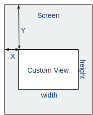
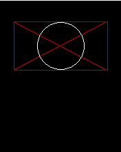

# Custom Views

**In this tutorial we shall create our own custom view, that utilizes the drawing commands to display content on the screen.**

Our software framework contains a selection of common *View* classes. These include TextLabels, Buttons and things like progress and state indicators. But you also have the ability to create your own views, to display custom content. Before we begin it is useful to know a little bit about views. Also, you should  see the [Display System Architecture](../articles/display_system_architecture.md) article.

## About Views

We have stolen the concept of a *View* from almost all other existing GUI frameworks. A *view* is a rectangular frame where you can draw primitives inside. All views define a *width* and *height*, along with a *x,y* position. These properties position all views on Mono's display - with respect to the display coordinates.



As you can see on the figure, the display coordinates have a *origo* at the top left corner of the screen. The positive *Y* direction is downward. In contrast to modern GUI frameworks Mono *views* cannot be nested and does not define their own internal coordinate system. All coordinates given to the drawing command are in display coordinates. It is your hassle to correct for the view's *x,y* offsets.

### Views can be Invisible and Dirty

All views has a visibility state. This state is used by the display system to know if it can render views to the screen. Only visible views are painted. By convention all views must be created in the *invisible* state. Further, views can also be *dirty*. This means that the view has changes that need to be rendered on the screen. Only dirty views are rendered. You can mark a view as dirty by calling the method: `scheduleRepaint()`.

### Painting views

When you create your own views, you must subclass the [`View`](../reference/mono_ui_View.html) class and you are required to overwrite 1 method: `repaint()`. This is the method that paints the view on the screen. The method is automatically called by the display system - you should never call it manually!

All views share a common [`DisplayPainter`](../reference/mono_display_DisplayPainter.html) object that can draw primitives. You should draw primitives only from inside the `repaint()` method. If you draw primitives from outside the method, you might see artifacts on the screen.

## The Goal

In this tutorial I will show you how to create a custom view that displays two crossing lines and a circle. To accomplish this we use the `DisplayPainter` routines `drawLine()` and `drawCircle()`, along with other routines to make our view robust. This means it does not make any assumptions about the screen state.

We want the cross and circle to fill the views entire *view rectangle*, so we use the view dimensions as parameters for the drawing functions.

## Creating the project

First go ahead and create a new project:

```
$ monomake project customView --bare
```

```eval_rst
.. note:: We use the `--bare` option to create an empty project without any example code.
```
It is good practice to create our custom view in separate files. Create two new files:

* *custom_view.h*
* *custom_view.cpp*

In the header file we define our new custom view class:

```cpp
class CustomView : public mono::ui::View {
public:

    CustomView(const mono::geo::Rect &rect);

    void repaint();
};
```

We overwrite only the constructor and the repaint function. The default constructor for *views* takes a [`Rect`](../reference/mono_geo_Rect.html) that defines the views position and dimensions.

In the implementation file (*custom_view.cpp*) we add the implementation of the two methods:

```cpp
// Constructor
CustomView::CustomView(const mono::geo::Rect &rect) : mono::ui::View(rect)
{

}

// and the repaint function
void CustomView::repaint()
{
    // enable anti-aliased line painting (slower but prettier)
    this->painter.useAntialiasedDrawing();

    // setup the view background color to pitch black
    painter.setBackgroundColor(mono::display::BlackColor);

    //draw the black background: a filled rect
    painter.drawFillRect(this->ViewRect(), true);

    // set the foreground color to a deep blue color
    painter.setForegroundColor(mono::display::MidnightBlueColor);

    // draw an outline rect around the view rectangle
    painter.drawRect(this->ViewRect());

    //set a new foreground color to red
    painter.setForegroundColor(mono::display::RedColor);

    //draw the first line in the cross
    painter.drawLine(this->ViewRect().UpperLeft(), this->ViewRect().LowerRight());

    //draw the second line in the cross
    painter.drawLine(this->ViewRect().LowerLeft(), this->ViewRect().UpperRight());

    //now we will draw the circle, with a radius that is the either width
    // or height - which ever is smallest.
    int radius;
    if (this->ViewRect().Width() < this->ViewRect().Height())
        radius = this->ViewRect().Width()/2;
    else
        radius = this->ViewRect().Height()/2;

    // create a circle object with center inside the views rectangle
    mono::geo::Circle c(this->ViewRect().Center(), radius - 1);

    //set the foreground color
    painter.setForegroundColor(mono::display::WhiteColor);

    //draw the circle
    painter.drawCircle(c);

    // disable anti-aliasing to make drawing fast for any other view
    painter.useAntialiasedDrawing(false);
}
```

Now, this code snippet is a mouthful. Let me break it down to pieces:

### The constructor

Our constructor simply forwards the provided `Rect` object to the parent (`View`) constructor. The parent constructor will take care of initializing the our views properties. In our implementation we simply call the parent constructor and leave the methods body empty.

### The repainting

This is here we actually paint the view. As mentioned earlier all views share a global `DisplayPainter` object. This object holds a set of properties like paint brush colors and anti-aliasing settings. Therefore, to be sure about what colors you are painting, you should always set the colors in your `repaint()` method.

We start by enabling anti-aliased drawing of lines. This slows down the painting process a bit, but the lines looks much smoother. Next, we set the *painters* background brush color to black. With the black color set, we draw a filled rectangle clearing the entire area of the view. This is important because there might be some old graphics present on the screen.

To highlight the views boundary rectangle we draw an outlined rectangle with the dimension of the views own rectangle. You can say we give the view a border.

Next, we begin to draw the crossing lines - one at the time. The `drawLine` routine take the begin and end points of the line. We use a set of convenience methods on the `Rect` class to get the positions of the *view rectangle*'s corners.

The [`Circle`](../reference/mono_geo_Circle.html) class defines circles by a center and a radius. We can get the *view rectangles* center using another convenient method on the `Rect` object. But we need to do a little bit of calculations to get the radius. We use the smallest of the width and height, to keep the circle within the view boundaries. (And subtract 1 to not overwrite the border.)

Lastly, we disable the anti-aliased drawing. To leave the `DisplayPainter` as we found it.

## The Result

Now, we must add our *CustomView* to our application. This means we must use it from the *AppController*. Therefore, include the header file in *app_controller.h*, and add our *CustomView* as a member variable:

```cpp
#include "custom_view.h"

class AppController : public mono::IApplication {
public:

    CustomView cv;
    
    AppController();
    //...
```

Finally, we need to initialize our view correctly in *AppController*'s constructor and set the views visibility state by calling the `show()` method.

In *app_controller.cpp* add:

```cpp
AppController::AppController() :
    cv(mono::geo::Rect(20,30,136,70))
{
}

void AppController::monoWakeFromReset()
{
    cv.show();
}
```
Notice that we set the views position and dimensions in the constructor, by defining a `Rect` \\\((20, 30, 136, 70)\\\).

Do a `make install` and our custom should look like this on your Mono:



Because we use the views own dimensions to draw the primitives, the view will paint correctly for all dimensions and positions.