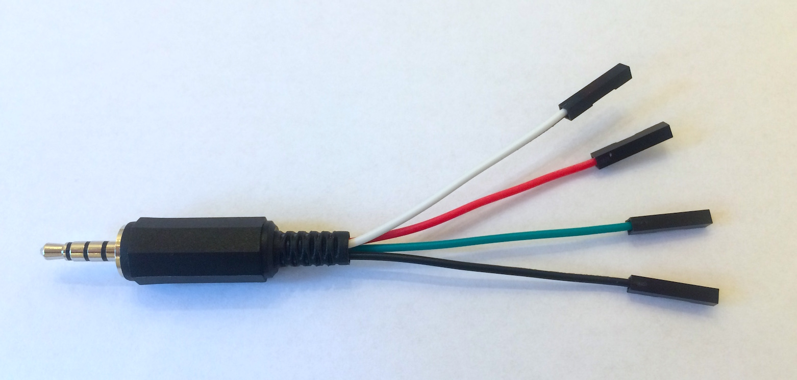

# Graph your heart beat

**In this tutorial we shall go through the steps of writing a very crude heart beat sensor. You will need some sensing hardware, either the one from [pulsesensor.com](http://pulsesensor.com) or you can roll your own, if you are a hardware wiz.**

The final app will render the input from the sensor as a graph on Mono's display. The heart beat will appear as spikes on the graph.

We will focus on the software. This is sampling the ADC at fixed intervals and updating the display. Further, if you wish to detect the frequency of the spikes, I will link to a nice article about the topic.

For starters, let us talk about the hardware setup.

### Wiring

Regardless of using *pulsesensor.com* or your own custom, there are a minimum of 3 connections needed:

```eval_rst
+--------------+--------+---------------------+----------+
| Signal       | Color  | 3.5mm Jack          | Mono Pin |
+==============+========+=====================+==========+
| Power (+)    | Red    | Tip                 | `J_TIP`  |
+--------------+--------+---------------------+----------+
| Gnd   (-)    | Black  | Sleeve (Base)       |          |
+--------------+--------+---------------------+----------+
| Analog ouput | Purple | Ring 1 (Outer most) | `J_RING1`|
+--------------+--------+---------------------+----------+
```

_The colors are in respect to pulsesensor.com's pin connections_

The *analog output* is the sensors signal that we need to feed to the ADC. The 5V power source we can get from Mono built-in boost converter, that we enable in software.

## Step 1

You need to have a 3 or 4 pole 3.5mm jack connector. If you have one in your stash, use that. If not, you need to go acquire one from the web or your favourite electronics pusher.

Then, solder the 3 wires from the pulse sensor to the connector, as layed out in the table above. (If you use a 4 pole jack, leave _Ring 2_ unconnected.)



For ease we have created a jack connector like this, that is essentially a breakout board for a 3.5mm jack connector. You can do the same, if you do not wish to solder directly on your *pulsesensor*.

### Software

When the hardware in place, we are ready to code! We need to do a few steps in software to acchieve the goal:

1. Enable voltage supply output in the jack tip pin
1. Sample the ADC in fixed intervals
1. Lowpass filter the ADC output
1. Draw a graph of the filtered signal.

## Step 2

First, we should create a new mono application project:

```
$ monomake project --bare pulsesensor
Creating new bare mono project: pulsesensor...
 * pulsesensor/app_controller.h
 * pulsesensor/app_controller.cpp
Writing Makefile: pulsesensor/Makefile...
Atom Project Settings: Writing Auto complete includes...
```

Notice the `--bare` option. This create an empty project without example code. Step into the newly created directory:

```
$ cd pulsesensor
```

Now, you should your favorite editor or IDE. Since we added a code completion settings file for Atom's [autocomplete-clang](https://atom.io/packages/autocomplete-clang) plugin, we use [Atom](https://atom.io) in the tutorial:

```
$ atom .
```

This command opens the project in Atom.

## Step 3: Drawing a Graph

Now that we have en empty project, we need a C++ class to draw the graph in the display. In Mono, all software classes that draw to the screen must inherit from the *View* class: `mono::ui::View`.

Create a new file called `graph.h`. This file should implement out `GraphView` class, that will draw the graph on the display. Then, paste this into the file:

```cpp
#include <mono.h>

class GraphView : public mono::ui::View
{
public:

    int values[176];
    int dataCursor;
    int dispCursor;

    GraphView(uint16_t yOffset, uint16_t height) :
    	View(mono::geo::Rect(0,yOffset,176,height))
    {
        dispCursor = 0;
        dataCursor = 0;
    }

    void append(int value)
    {
   	 	 static const int maxX = 0x8000;
    	 static const int minX = 0x4000;
    
        if (value < minX)
            value = minX;
        else if (value > maxX+minX)
            value = maxX+minX;

        int scaled = (value * viewRect.Height() / maxX);
        int graphOffset = minX * viewRect.Height() / maxX;
        values[dataCursor++] = scaled - graphOffset;

        if (dataCursor >= 176)
            dataCursor = 0;
    }

    void repaint()
    {
        painter.setForegroundColor(mono::display::RedColor);
        painter.setBackgroundColor(StandardBackgroundColor);

        if (dispCursor < dataCursor)
        {
            drawDiff(dispCursor, dataCursor);
            dispCursor = dataCursor;
        }
        else
        {
            drawDiff(dispCursor, viewRect.Width());
            dispCursor = 0;
        }

        painter.setForegroundColor(mono::display::GreenColor);
        painter.drawVLine(dispCursor, viewRect.Y(), viewRect.Y2());
    }

    void drawDiff(int begin, int end)
    {
        for(int x = begin; x<end; x += 2)
        {
            painter.drawFillRect(x, viewRect.Y(), 2, viewRect.Height(), true);
            painter.drawFillRect(x, viewRect.Y()+values[x], 2, 2);
        }
    }

};
```

Let us go through the code, step by step.

#### Declaration

First we declare the class `GraphView` and define it inherits from `View`. We define 3 member variables, an array of sample values and cursors that points to the lastest sample.

#### Constructor

The class' constructor takes 2 arguments, an *Y* offset and a height. The graph will always take up the full width of the screen, which is 176 pixels. The *Y* offset defines where the view is positioned with repect to top of the screen.

The body of the constructor sets the 2 cursor variables to zero. This is important in an embedded environment, since you cannot know the initial value of a variable.

#### Append method

The `append(int)` method adds a new value to the graph and increments the cursor. First the new value is cropped to the *max* and *min* boundaries defined by the static variables.

Next, we scale the value to fit the height of the graph view itself. Before adding the new value to the sample array, we substract a static offset.

```eval_rst
.. attention:: In Mono's *display coordinate system* the *Y* axis is flipped. This means positive *Y* direction is downward.
```

The static offset (`graphOffset`) ensures that that center of the graph is the center of the value boundaries. The input span is trimmed from `0` to `0xFFFF`, to `0x4000` to `0x8000`.

```eval_rst
.. hint:: I have chosen these numbers to ease the CPU's integer division. When dividing by exponents of 2, the compiler can substitute the division with shift operation.
```

The scaled value is saved in the values array, and the `dataCursor` is incremented. If the cursor exeeds the width of the array, it is reset to `0`.

#### Repaint

The `repaint()` method is part of the *View* interface, and is automatically called by the display system. Inside this method we implement the actual drawing of the graph.

All *Views* share a `painter` object that can draw shapes on the screen. First, we set the painters color palette, a foreground and a background.

Next, if the data cursor is larger than the display cursor, we call the `drawDiff` method for the difference. Lastly the `dispCursor` is set equal to the data cursor. The other branch of the `if` statement is taken when the `dataCursor` has looped or reset. In this case we draw the data from display cursor position up to the end of the array.

The last task is to draw the green sweeping cursor, that indicate the end of the buffer. We set the foreground color palette to green, and draw a vertical line at the display cursor position.

#### drawDiff

This is where the graph drawing occurs. We receive two parameters the begining and the end of the array values to draw. We loop through the values and at each value we paint a 2 pixel wide vertical line, using the background color. Then, we draw a filled rectangle 2x2 pixels, at the x value position.

This is the graph class, that can draw an array of values as a graph on the screen.

```eval_rst
.. note:: You might wonder where the *.cpp* implementation file for this class is. Our can implement function bodies in header files. However, this is not best practice. My only excuse to do it here, is that I am lazy and I try to keep this tutorial as short as possible.
```

## Step 4

Now we will turn attention to the *app_controller.h* and *.cpp* files. In this object, we will control power and ADC sampling, lowpass filter and utilize our graph view.

Now the class is just a stub of empty methods. Start by going to the *app_controller.h* and we will some member variables. Edit (or copy-paste) your copy to look like this:

```cpp
#ifndef app_controller_h
#define app_controller_h

#include <mono.h>
#include <mbed.h>
#include "graph.h"

class AppController : public mono::IApplication {
public:

    mbed::AnalogIn adc;			// Analog input
    mbed::Ticker adcTicker;		// interrupt based timer
    GraphView graph;			// Our graph view

    uint16_t filter[8];			// Low pass filter memory
    int filterPos;				// Filters oldest sample pointer

    AppController();			// default constructor

    void sampleAdc();			// sample ADC & update display

    void monoWakeFromReset();
    void monoWillGotoSleep();
    void monoWakeFromSleep();
};

#endif /* app_controller_h */
```

Basically we have added member variables to handle the analog pin input, a timer (called a `Ticker` in mbed) to sample at regular intervals and a moving average lowpass filter.

We also added the method `sampleAdc()` that should called by the `Ticker` when the analog input must be sampled.

#### AppController implementation

Now, go to the *app_controller.cpp* file and overwrite its contents with this:

```cpp
#include "app_controller.h"

AppController::AppController() :
    adc(J_RING2),
    graph(50, 220-50)
{
    adcTicker.attach_us(this, &AppController::sampleAdc, 10000);

    graph.show();

    filterPos = 0;
    memset(filter, 0, 8);
}

void AppController::sampleAdc()
{
    filter[filterPos++] = adc.read_u16();

    if (filterPos >= 8)
        filterPos = 0;

    int sum = 0;
    for (int i=0;i<8;i++)
        sum += filter[i];

    graph.append( sum / 8 );

    graph.scheduleRepaint();
}

void AppController::monoWakeFromReset()
{
    // enable J_TIP power
    mbed::DigitalOut jpi(JPI_nEN, 1);
    mbed::DigitalOut jpo(JPO_nEN, 0);

}

void AppController::monoWillGotoSleep()
{
    mbed::DigitalOut jpi(JPI_nEN, 1);
    mbed::DigitalOut jpo(JPO_nEN, 1);

    adcTicker.detach();
}

void AppController::monoWakeFromSleep()
{
    mbed::DigitalOut jpi(JPI_nEN, 1);
    mbed::DigitalOut jpo(JPO_nEN, 0);

    adcTicker.attach_us(this, &AppController::sampleAdc, 10000);

    graph.scheduleRepaint();
}
```

I will chop up the code and explain the functions and meaning bit by bit.

#### Constructor

When our AppController class is constructed by the system, it needs to setup two of its member objects: `mbed::AnalogIn` and our own `GraphView`. These have designated constructors that we need to call explicitly, and we do that in the contructor right before the actual body:

```cpp
AppController::AppController() :
    adc(J_RING1),
    graph(50, 220-50)
{
	...
```

We define that we what the ADC to sample the `J_RING1` pin. The GraphView is set to occupy the lower 3/4 of the screen. This is defined by the *Y* offset og 50 pixels and a height of 170 pixels.

```cpp
adcTicker.attach_us(this, &AppController::sampleAdc, 10000);

graph.show();

filterPos = 0;
memset(filter, 0, 8);
```

In the body we first install the callback function for the `Ticker`. It will call `sampleAdc` every 10 ms. This gives a samplerate of 100 Hz.

We tell out `graph` to be visisble, meaning that the display system will bother to paint it.

Lastly, the running average filter is initialized. We zero all values and set the pointer to 0.

#### Sampling the input

The `sampleAdc` method is called by the `Ticker` from inside the MCU timer interrupt. This means that this method will run inside a interrupt context. This means it must be fast.

```cpp
filter[filterPos++] = adc.read_u16();

if (filterPos >= 8)
    filterPos = 0;
```

First the sample the input pin, and get the result as an unsigned 16 bit integer. This sample value is stored in the filters array and the position is incremented.

When the position reaches the end of the array, it is reset.

```cpp
int sum = 0;
for (int i=0;i<8;i++)
    sum += filter[i];
	
graph.append( sum / 8 );
```

Before inserting the new value into the graph, we lowpass filter it, by calculating the average value of the filter array. This average is appended to the graph.

```eval_rst
.. note:: This filtering should remove any 50 Hz or 60 Hz noise. If it does not, you might need to tweak it a little bit. (Changing the array length.)
```

```cpp
graph.scheduleRepaint();
```

The final line tells the graph that it must repaint itself, at the next *vsync* event. Note that we not not repaint the graph view from here, it is only scheduled for repaint at a later oint in time.

#### Power event methods

The next 3 method are the standard power event methods, handling reset, sleep and wake routines. Here we need to setup the power and shut it down again upon sleep.

```cpp
void AppController::monoWakeFromReset()
{
    // enable J_TIP power
    mbed::DigitalOut jpi(JPI_nEN, 1);
    mbed::DigitalOut jpo(JPO_nEN, 0);

}
```

We use the mbed's I/O interfaces to set the values of the power control switches on Mono. Specifically we set the `JPI_nEN` and the `JPO_nEN` pins to enable a power output on the jack connector's *TIP* pin. By asserting `JPO_nEN` we connect the `VAUX` power line to `J_TIP`.

Just to make our intension clear, we also deaasert `JPI_nEN`, to explicitly state that there is no short circuit from `VAUX` to `VBUS`. (Refer to the [schematics](/schematics/index.md) for Mono.)

```cpp
void AppController::monoWillGotoSleep()
{
    mbed::DigitalOut jpi(JPI_nEN, 1);
    mbed::DigitalOut jpo(JPO_nEN, 1);

    adcTicker.detach();
}
```

In the go-to-sleep routine we cut the power to `J_TIP` and disable the `Ticker`. If we do not disable the ticker, we risk having the timer fire when the RTC system runs in sleep mode.

```cpp
void AppController::monoWakeFromSleep()
{
    mbed::DigitalOut jpi(JPI_nEN, 1);
    mbed::DigitalOut jpo(JPO_nEN, 0);

    adcTicker.attach_us(this, &AppController::sampleAdc, 10000);

    graph.scheduleRepaint();
}
```

Upon wake-up we re-enable power output on `J_TIP` and activate the Ticker again. Because the display has been powered off, we also need to repaint its content.

## Step 5

Now is the moment of truth, where you should compile our app. Go to the terminal and run:

```
$ make
```

Hopefully it compiles and you should see something like this:

```
rm -f pulsesensor.elf mono_project.map
rm -f -r build
creating build directory
Compiling C++: app_controller.cpp
Compiling C++: Default main function
Linking pulsesensor.elf
```

Install the app on your Mono by running:

```
$ make install
```
