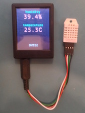
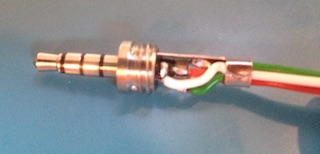
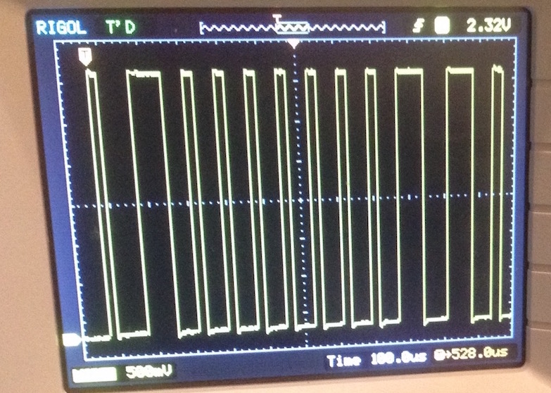

# Humidity harware setup

The purpose of this tutorial is to show you how to build a humidity app.



## Sensor

To get humidity readings into my Mono, I will need a humidity sensor.  For this app I will use the relatively low cost sensor [DHT11](https://www.adafruit.com/products/386) or [DHT22](https://www.adafruit.com/products/385).  Their underlying hardware communication protocol is the same, but the interpretation of the readings differ slightly (DHT22 has better resolution).

## Connecting the sensor to Mono

The sensor uses a single wire to transmit data, and it must get power through two additional wires (VCC and ground).

So I need three wires in total from Mono to the sensor.  Mono's mini-jack mount accomodates four lines, so I will solder a set of wires to a mini-jack connector.  For this particular application, I could use a regular three-wire mini-jack, but the mini-jack connector I have has four connections, so I will solder all four and reserve the fourth wire for future experiments.



Here I have put a red wire on the tip, a white wire on ring 1 (the one next to the tip), a black wire on the sleeve.  The green wire is on ring 2, but it is not used in the app.

With that taken care of, I can connect the sensor to my Mono, and start pulling out data from the sensor.

## Data communication

To sanity check the connection, I will make the simplest possible app that can request a reading from the sensor, and then view the result on an oscilloscope, so I can see that the sensor is working.  **You do not need to do this**, but let's try and see what the sensor communication looks like.

An application to get the sensor talking must put 3.3V on the tip (red wire), and then alternate the data line (white wire) between 3.3V and 0V to tell the sensor that it needs a reading.  The sleeve (black wire) is by default set to 0V, so nothing needs to be setup there.

More specificly, the data line must be configured to be an output pin with [pullup](https://learn.sparkfun.com/tutorials/pull-up-resistors).  To request a reading from the sensor, the data line needs to be pulled down to 0V for 18ms, and then set back to 1.  After that, the sensor will start talking.

The following program makes such a request every 3 seconds.

```c++
#include <mono.h>
#include <mbed.h>

class AppController
:
    public mono::IApplication
{
    mono::Timer measure;
    mbed::Ticker ticker;
    mono::io::DigitalOut out;
    void put3V3onTip ()
    {
        DigitalOut(VAUX_EN,1);
        DigitalOut(VAUX_SEL,1);
        DigitalOut(JPO_nEN,0);
    }
    void requestSensorReading ()
    {
        out = 0;
        ticker.attach_us(this,&AppController::letGoOfWire,18*1000);
    }
    void letGoOfWire ()
    {
        out = 1;
    }
public:
    AppController()
    :
        measure(3*1000),
        out(J_RING1,1,PullUp),
    {
        measure.setCallback<AppController>(this,&AppController::requestSensorReading);
    }
    void monoWakeFromReset ()
    {
        put3V3onTip();
        measure.Start();
    }
    void monoWillGotoSleep ()
    {
        DigitalOut(JPO_nEN,1);
    }
    void monoWakeFromSleep () {}
};
```

When I connect Mono to the sensor, and hook up an oscilloscope to the data and ground wires, then I get the following picture of the communication when I run the app.



To the left you can see a tiny bit of the end of the 18ms period, ending in a rising edge (the transition from 0V to 3.3V) marked by **T** (the trigger point).
From there on, the sensor takes over and starts alternating the data line between 3.3V and 0V.

The first 3.3V period is just a handshake, and after that the length of each 3.3V period determines whether data sent from the sensor is a logical 1 or a logical 0.  For the screenshot above, the visible part of data is 0000000110.

What exactly does that mean?  Well, I will tell you in the next part.
