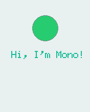

# Periodically call a Function

***In this quick example we will see how to use a [`Timer`](/en/latest/reference/mono_Timer.html) to repetitively call a function***

A big part of developing apps is do tasks at regular intervals. Mono employs a timer architecture that allows you to schedule single or recurring function calls, ahead of time. The semantics are "*call this function 3 minutes from now*", or "*call this method every 45 second*".

## Timers

The timer system on Mono is very powerful, you can schedule as many timers as of like! (Okay, you are limited by the amount of RAM). The timers are instances of the class `Timer` and they are built upon the [`bed::Ticker`](https://developer.mbed.org/handbook/Ticker) class. This architecture leverages the versatility of the *mbed* timers and adds thread safety from Mono's own `Timer` class.

You can schedule a method to be called 5 minutes from now, by a single line of code:

```cpp
mono::Timer::callOnce<MyClass>(5*60*1000, this, &MyClass::MyCallbackMethod);
```

This will create a timer instance on the heap, and it will deallocate itself after it has fired. Because we use C++ methods, and not C functions as callbacks, you must provide the `this` pointer and the type definition of the context. (`MyClass` in the example above.) The last parameter is the pointer to the actual method on the class. This makes the call a bit more verbose, compared to C function pointers, but being able define callback methods in C++ is extremely powerful.

```eval_rst
.. note:: In recent versions of C++ (C++11 and C++14), lambda functions has been added. These achieve the same goal with a cleaner syntax. However, we cannot use C++11 or 14 on Mono, the runtime is simply too large!
```

## Call a function every second

Now, let us see how to repeatedly call a function every second. First, we create a new project from the console / terminal:

```
$ monomake project timerExample
```

Open the *app_controller.h* file and add a `Timer` as a member on the `AppController` class, and define the method we want to be called:

```cpp
class AppController : public mono::IApplication {
    
    // This is the text label object that will displayed
    TextLabelView helloLabel;
    
    // this is our timer object
    Timer timer;
    
public:

	//this is our method we want the timer to call
	void timerFire();
```

Because we want to repetitively call a function, we need the timer to stick around and not get deallocated. Therefore, it is declared as a member variable on `AppController`. In the implementation file (*app_controller.cpp*) we need to initialize it, in the constructors initialization list:

```cpp
AppController::AppController() :

    // Call the TextLabel's constructor, with a Rect and a static text
    helloLabel(Rect(0,100,176,20), "Hi, I'm Mono!"),
    // set our timers interval to 1000 ms
    timer(1000)
{
```

Let us add the body of the `timerFire` method to the implementation  file, also:

```cpp
void AppController::timerFire()
{
    printf("Timer did fire!\t\n");
}
```

Lastly, we tie the timer callback handler to out method. This is done from inside the `monoWakeFromReset` method:

```cpp
void AppController::monoWakeFromReset()
{
    // tell the label to show itself on the screen
    helloLabel.show();
    
    // set the timers callback handler
    timer.setCallback<AppController>(this, &AppController::timerFire);
    // start the timer
    timer.Start();
}
```

All right, go to the console and run `make install` and our app should compile and upload to mono. Open a serial terminal and you should see:

```
Timer did fire!
Timer did fire!
Timer did fire!
Timer did fire!
```

Arriving with 1 second intervals.

## Timing the UI

Now, let us step it up a bit. We want to toggle a UI element with our timer function. The SDK includes a class called [`StatusIndicatorView`](/en/latest/reference/mono_ui_StatusIndicatorView.html), it mimics a LED that just is *on* or *off*. Lets add it as a member on our `AppController`:

```cpp
class AppController : public mono::IApplication {
    
    // This is the text label object that will displayed
    TextLabelView helloLabel;
    
    Timer timer;
    
    StatusIndicatorView stView;
```

We also need to initialize with position and dimension in the initializer list:

```cpp
AppController::AppController() :

    // Call the TextLabel's constructor, with a Rect and a static text
    helloLabel(Rect(0,100,176,20), "Hi, I'm Mono!"),
    // set our timers interval to 1000 ms
    timer(1000),
    
    stView(Rect(75,55,25,25))
{
```

Then, in the `monoWakeFromReset` method we must set its *visibility state *to *shown*:

```cpp
// tell the label to show itself on the screen
helloLabel.show();

// set the timers callback handler
timer.setCallback<AppController>(this, &AppController::timerFire);
// start the timer
timer.Start();

stView.show();
```

Last we insert code to toggle its state in the `timerFire` method:

```cpp
void AppController::timerFire()
{
    printf("Timer did fire!\t\n");
    
    stView.setState(!stView.State());
}
```

Go compile and run the modified code. You should see this on your mono:



## Sample code

Here is the full source code for reference:

**app_controller.h**:

```cpp
#ifndef app_controller_h
#define app_controller_h

// Include the Mono Framework
#include <mono.h>

// Import the mono and mono::ui namespaces into the context
// to avoid writing long type names, like mono::ui::TextLabel
using namespace mono;
using namespace mono::ui;

// The App main controller object.
// This template app will show a "hello" text in the screen
class AppController : public mono::IApplication {
    
    // This is the text label object that will displayed
    TextLabelView helloLabel;
    
    Timer timer;
    
    StatusIndicatorView stView;
    
public:
    
    //this is our method we want the timer to call
	void timerFire();

    // The default constructor
    AppController();

    // Called automaticlly by Mono on device reset
    void monoWakeFromReset();

    // Called automatically by Mono just before it enters sleep mode
    void monoWillGotoSleep();

    // Called automatically by Mono right after after it wakes from sleep
    void monoWakeFromSleep();
    
};

#endif /* app_controller_h */
```

**app_controller.cpp**:

```cpp
#include "app_controller.h"

using namespace mono::geo;

// Contructor
// initializes the label object with position and text content
// You should init data here, since I/O is not setup yet.
AppController::AppController() :

    // Call the TextLabel's constructor, with a Rect and a static text
    helloLabel(Rect(0,100,176,20), "Hi, I'm Mono!"),
    // set our timers interval to 1000 ms
    timer(1000),
    
    stView(Rect(88,55,25,25))
{

    // the label is the full width of screen, set it to be center aligned
    helloLabel.setAlignment(TextLabelView::ALIGN_CENTER);
    
    // set another text color
    helloLabel.setTextColor(display::TurquoiseColor);
}

void AppController::timerFire()
{
    printf("Timer did fire!\t\n");
    
    stView.setState(!stView.State());
}

void AppController::monoWakeFromReset()
{
    // At this point after reset we can safely expect all peripherals and
    // I/O to be setup & ready.

    // tell the label to show itself on the screen
    helloLabel.show();
    
    // set the timers callback handler
    timer.setCallback<AppController>(this, &AppController::timerFire);
    // start the timer
    timer.Start();
    
    stView.show();
}

void AppController::monoWillGotoSleep()
{
    // Do any clean up here, before system goes to sleep and power
    // off peripherals.

}

void AppController::monoWakeFromSleep()
{
    // Due to a software bug in the wake-up routines, we need to reset here!
    // If not, Mono will go into an infinite loop!
    mono::IApplicationContext::SoftwareResetToApplication();
    // We never reach this point in the code, CPU has reset!

    // (Normally) after sleep, the screen memory has been cleared - tell the label to
    // draw itself again
    helloLabel.scheduleRepaint();
}
```