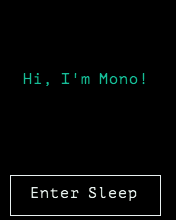

# Sleep Mode

***In this tutorial we will quickly demonstrate how to put Mono into sleep mode.***

Mono has no physical on/off switch, so you cannot cut the power from the system. This means you *must always* provide a way for Mono to goto to sleep. Sleep mode is the closest we come to being powered off. Mono's power consumption in sleep mode is around 50 µA (micro amperes), which is really close to no consumption at all.

## Default behaviour

Because it is crusial to be able to turn off Mono (goto sleep mode), we provide this functionality by default. When you create a new project with:

```
$ monomake project MyNewProject
```

The SDK predefines the behaviour of the *User button*, to toggle sleep mode. This is important because controlling on/off functionality, is not what is first on your mind when developing new mono apps. So you dont't have to consider it too much, unless to wish to use the *User button* for something else.

## Sleep and USB

In our *v1.1* release of our SDK, we enabled sleep mode while connected to the USB. This means that triggering sleep will power-down Mono's USB port. Therefore our computer will loose connection to Mono if it goes to sleep.

When you wake up Mono, it will be enumerated once again.

## Sleep and external power

Mono has the ability to provide power for components mounted either on the *Mono Shield Adaptor* or attached through the *3.5mm jack connector*. By default Mono provides 3.3V on this external power rail (called `VAUX`). To safe battery life, the `VAUX` power if turned off in sleep mode. This is the default behaviour, but you can change it if you need to.

In the *3.5mm jack connector* the power on `J_TIP` in sleep mode depends on the USB state. If USB is connected the voltage on `J_TIP` is 1.7V, because of leakage currents from `VBUS`. With no USB attached, the `J_TIP` voltage is 0.0V in sleep mode.

```eval_rst
.. warning:: We have introducted this behaviour in `Release 1.4`. Before this version the ``VAUX`` line was not limited to 3.3V! Especially in sleep mode, the voltage rises to the battery's current voltage level. In `Release 1.4` we fixed this issue, by turning off auxillary power in sleep mode.
```

You can consult the [schematics](../schematics/index.md) to see how the power system is configured.

## Triggering sleep mode

Say we have an application that utilizes the *User button* to do something else, than toggling sleep mode. Now we need another way of going to sleep, so lets create a button on the touch screen to toggle sleep. First in our *app_controller.h* we add the `ButtonView` object to the class:

```cpp
class AppController : public mono::IApplication {

	// we add our button view here
	mono::ui::ButtonView sleepBtn;

	// ... rest of appcontroller.h ...
```

In the implementation file (*app_controller.cpp*) we initialize the button, setting its position and dimensions on the screen. We also define the text label on the button:

```cpp
AppController::AppController() :
	
	//first we call the button constructor with a Rect object and a string
	sleepBtn(Rect(10,175,150,40), "Enter Sleep"),

	// here comes the project template code...
    // Call the TextLabel's constructor, with a Rect and a static text
    helloLabel(Rect(0,100,176,20), "Hi, I'm Mono!")
{
```

Now, we need to tie a function to the button's click handler. That means when the button is clicked, it automatically triggers a function to be called. We can call the standard static function for going to sleep, that is defined in the global `IApplicationContext` object. The function is:

```cpp
mono::IApplicationContext::EnterSleepMode();
```

Normally, we could just add this function directly to the button's callback handler, but in this particular case it is not possible! The callback handler always expects a member function, not a static class function like `EnterSleepMode`. So we need to define a member function on our `AppController` and wrap the call inside that.

Inside *app_controller.h* add:

```cpp
public:

    // The default constructor
    AppController();
    
    // we add our sleep method here:
    void gotoSleep();

    // Called automaticlly by Mono on device reset
    void monoWakeFromReset();
```

Then in the implementation file (*app_controller.cpp*), we define the body of the function to:

```cpp
void AppController::gotoSleep()
{
    mono::IApplicationContext::EnterSleepMode();
}
```

Lastly, we tell the `sleepBtn` object to call our function, when it gets clicked - we do this from *AppController*'s constructor:

```cpp
// set another text color
helloLabel.setTextColor(display::TurquoiseColor);

// tell the button to call our gotoSleep function
sleepBtn.setClickCallback<AppController>(this, &AppController::gotoSleep);

// tell the button to show itself on the screen
sleepBtn.show();
```

Okay, go compile and install the app on Mono - and you should see this on the screen:



Try to press the button and you will see Mono goto sleep and turning off the display. In this example you wake Mono again just by pressing the *User button*.

```eval_rst
.. danger:: Be aware that if you overwrite the `User Button` functionality, you are responsible for ensuring that Mono has a wake up source. A wake source is always a physical input pin interrupt. In most cases you should use the User button. 
```

In another tutorial we shall see how you overwrite the *User button* functionality.

## Complete sample code

For reference, here is the complete sample code of the tutorial:

**app_controller.h:**

```cpp
#ifndef app_controller_h
#define app_controller_h

// Include the Mono Framework
#include <mono.h>

// Import the mono and mono::ui namespaces into the context
// to avoid writing long type names, like mono::ui::TextLabel
using namespace mono;
using namespace mono::ui;

// The App main controller object.
// This template app will show a "hello" text in the screen
class AppController : public mono::IApplication {
    
    // we add our button view here
    mono::ui::ButtonView sleepBtn;
    
    // This is the text label object that will displayed
    TextLabelView helloLabel;
    
public:

    // The default constructor
    AppController();

    // we add our sleep method here:
    void gotoSleep(); 

    // Called automaticlly by Mono on device reset
    void monoWakeFromReset();

    // Called automatically by Mono just before it enters sleep mode
    void monoWillGotoSleep();

    // Called automatically by Mono right after after it wakes from sleep
    void monoWakeFromSleep();
    
};

#endif /* app_controller_h */
```

**app_controller.cpp:**

```cpp
#include "app_controller.h"

using namespace mono::geo;

// Contructor
// initializes the label object with position and text content
// You should init data here, since I/O is not setup yet.
AppController::AppController() :
    
    //first we call the button constructor with a Rect object and a string
    sleepBtn(Rect(10,175,150,40), "Enter Sleep"),
    
    // Call the TextLabel's constructor, with a Rect and a static text
    helloLabel(Rect(0,100,176,20), "Hi, I'm Mono!")
{

    // the label is the full width of screen, set it to be center aligned
    helloLabel.setAlignment(TextLabelView::ALIGN_CENTER);
    
    // set another text color
    helloLabel.setTextColor(display::TurquoiseColor);
    
    // tell the button to call our gotoSleep function
    sleepBtn.setClickCallback<AppController>(this, &AppController::gotoSleep);

    // tell the button to show itself on the screen
    sleepBtn.show();
}

void AppController::gotoSleep()
{
    mono::IApplicationContext::EnterSleepMode();
}

void AppController::monoWakeFromReset()
{
    // At this point after reset we can safely expect all peripherals and
    // I/O to be setup & ready.

    // tell the label to show itself on the screen
    helloLabel.show();
}

void AppController::monoWillGotoSleep()
{
    // Do any clean up here, before system goes to sleep and power
    // off peripherals.

}

void AppController::monoWakeFromSleep()
{
    // Due to a software bug in the wake-up routines, we need to reset here!
    // If not, Mono will go into an infinite loop!
    mono::IApplicationContext::SoftwareResetToApplication();
    // We never reach this point in the code, CPU has reset!

    // (Normally) after sleep, the screen memory has been cleared - tell the label to
    // draw itself again
    helloLabel.scheduleRepaint();
}
```