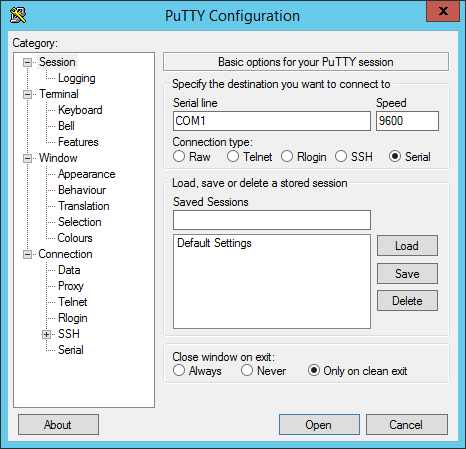

# Using Mono's Serial port

***Let us examine how to use Mono's built in USB Serial port, and how to monitor it from your computer***

By default when you plug in Mono's USB cable to a computer, Mono will appear as a USB CDC device. If you run Windows you have to install a driver, please goto [this section](#serial-port-windows-driver) to see how.

## Get a Serial Terminal

First you need a serial terminal on your computer. Back in the old Windows XP days there was *Hyper Terminal*, but I guess it got retired at some point. So both Mac/Linux and Windows folks need to go fetch a serial terminal application from the internet.

**Windows Serial apps:**

* [PuTTY](http://www.putty.org)
* [Tera Term](https://ttssh2.osdn.jp/index.html.en)
* [Real-Term](http://realterm.sourceforge.net)
* [YAT (Yet Another Terminal)](https://sourceforge.net/projects/y-a-terminal/)
* [CoolTerm](http://freeware.the-meiers.org)

**Mac / Linux Serial apps**

* [CoolTerm](http://freeware.the-meiers.org) 
* [Minicom](https://alioth.debian.org/projects/minicom/) (What we are using!)
* [ZTerm](http://www.dalverson.com/zterm/) (Mac only)
* [SerialTools](http://www.w7ay.net/site/Applications/Serial%20Tools/) (Mac only)

We are very happy with *minicom*, since it has a feature that makes it really great with Mono. More about that later! Unfortunately *minicom* does not run on Windows, so we are considering making our own serial terminal client for Windows - that is similar to *minicom*.

If you use Linux / Mac, you should properly install *minicom* now. But you do not have to, you can also use any of the other choices.

### Installing *minicom*

To install minicom on a Debian based Linux you should just use *aptitude* or *apt-get*:

```
$ sudo aptitude install minicom
```

On Mac you need the package manager called [Homebrew](http://brew.sh). If you don't have it, go get it from their homepage. When you are ready type:

```
$ brew install minicom
```

## Sending data from Mono

Transferring text or binary data from Mono is really easy. In fact we have standard I/O from the standard C library available! To write some text to the serial port just do:

```cpp
printf("Hello Serial port!!\t\n");
```

Notice that we ended the line with `\t\n` and not only `\n`. That is because the serial terminal standard is quite old, therfore many serial terminals expects both a *[carriage return](https://en.wikipedia.org/wiki/Carriage_return#Computers)* and a *[line feed](https://en.wikipedia.org/w/index.php?title=Linefeed)* character.

To capture output from Mono in a terminal, we need to continuesly output text. Therefore we need to call the print function periodicly.

In *app_controller.h*:

```cpp
class AppController : mono::IApplication
{
public:
	
	//Add a timer object to our appController
	mono::Timer timer;
	
	// just a counter variable - for fun
	int counter;
	
	// class contructor
	AppController();
	
	// add this method to print to the serial port
	void outputSomething();
	
	
	// ...
```

Then in *app_controller.cpp*:

```cpp
AppController::AppController()
{
	// in the contructor we setup the timer to fire periodicly (every half second)
	timer.setInterval(500);
	
	// we tell it which function to call when it fires
	timer.setCallack<AppController>(this, &AppController::outputSomething);
	
	// set the counter to zero
	counter = 0;
	
	//start the timer
	timer.Start();
}

void AppController::outputSomething()
{
	printf("I can count to: %i",counter++);
}
```

Compile and upload the app to Mono.

```eval_rst
.. note:: We are following best practice here. We could also have created a loop and a ``wait_ms()`` and ``printf()`` statement inside. But that would have broken serial port I/O!
```

## Connecting to Mono

When Mono is plugged in to the USB port, you should see a serial device on your computer. In Windows a *COM* port should be present in *Device manager*. On Linux / Mac there should exist a I/O device in the folder `/dev`. On Mac it would be named something like `/dev/cu.usbmodem1246`. On Linux the name could be `/dev/ttyACM0`.

If you use *minicom* you connect to the serial port with the `-D` flag, like this:

```
$ minicom -D /dev/cu.usbmodem1246
```

With PuTTY on Windows you should check the *COM* port number in *Device Manager* and type the this number in the *Serial line* text box:



Now you should be connected to the Mono serial output:

```
I can count to: 3
I can count to: 4
I can count to: 5
I can count to: 6
```

Because Mono does not wait for you to open the serial port, you might loose some output. That is why you properly will not see *I can count to 0* and *I can count to 1*. At some point we might change this behaviour and add a larger output buffer on Mono.

```eval_rst
.. attention:: Currently the serial API in the Mono's SDK support only writing. This means you can only transfer data from Mono to your serial terminal. On the next SDK release we will implement receiving data as well.
```

## Reconnects and Resets

You will soon discover that every time Mono resets, when uploading new apps or likewise, the serial port disappears. If you are not using *minicom*, you will have to manually connect to the port again. That is why we prefer to use *minicom*, because it automatically connects again when the port re-appears.

If you are not using *minicom* you will get pretty tired of reconnecting over and over again. At some point you might even consider helping us out with a .NET based serial tool to resolve the issue :-)

### Why does the serial port disappear?

Unlike Arduino, Mono does not have a dedicated serial port to USB chip. We use the CPU's built-in USB component to create the serial port. This means that when the CPU is reset, the USB port is reset. That efficiently ends the serial connection. There is no way around this issue, expect using a dedicated USB chip.

### Reset over the USB

Like Arduino we also use the Serial connection to trigger resets. Before a new application can be uploaded to Mono, we have to put it into bootloader. This is done by a reset, just like Arduino does. We use the serial port's DTR line to trigger a reset. Mono continuously monitors the DTR line, ready to trigger a software reset on itself.

If you do not follow the coding best practice convention and do something ugly, like this:

```cpp
while(1)
{
	// I just wanna stay here for the rest of time ...
}
```

You have effectively cut off the possibility of resetting using the DTR, to trigger a software reset.

## Serial Port Windows Driver

Windows do not support mapping USB CDC devices to Serial ports (COM devices) out of the box. It needs an `.inf` file to tell it to do so. You can download this [INF file here](https://raw.githubusercontent.com/getopenmono/mono_psoc5_library/master/Generated_Source/PSoC5/USBUART_cdc.inf), but it should have been installed automatically. The driver is included in both the [Monokiosk based installer](https://monokiosk.com/get-started) and the [SDK toolchain](http://developer.openmono.com/en/latest/getting-started/install.html).

```eval_rst
.. attention:: Windows 8 and Windows 10 users will not have the driver installed automatically! These versions of Windows allows only signed drivers to be installed. We have yet to obtain our code signing certificate. In the mean time you can disable this check, by following `this guide <https://learn.sparkfun.com/tutorials/disabling-driver-signature-on-windows-8/disabling-signed-driver-enforcement-on-windows-8>`_.
```